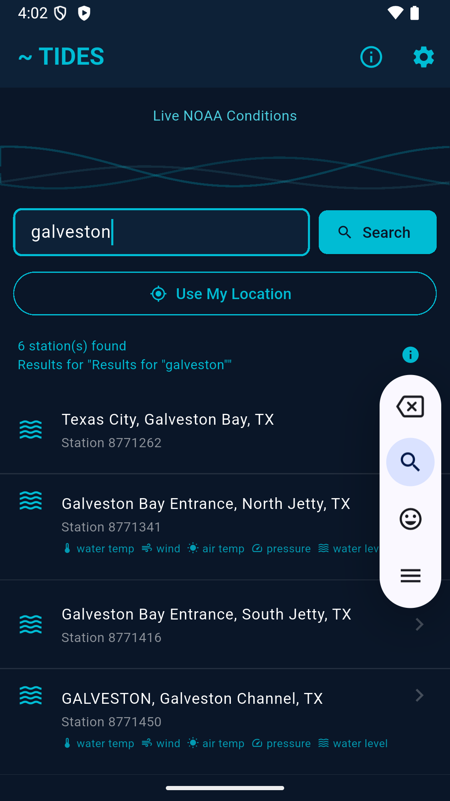

# Tides — Live NOAA Tide App for Android

A Flutter app for Android that shows real-time NOAA tide data, weather conditions, solunar tables, and fishing ratings. Built for fishermen and boaters who need quick, reliable tidal information on the water.

## Download

**[Latest release on GitHub Releases](https://github.com/SilasMarner/tides-mobile/releases/latest)** — download the `.apk` and tap to install.

To sideload: enable *Install unknown apps* for your file manager in Android Settings → Apps, download the APK, and tap to install.

---

## Screenshots

| Home | Search Results | Conditions & Waves |
|------|---------------|-------------------|
|  |  |  |

| Tides, Solunar & Moon | Wind Map | Wind Map Overlays |
|----------------------|----------|-------------------|
|  |  |  |

| Salinity Map (NOAA NGOFS2 forecast loop) |
|------------------------------------------|
|  |

---

## Changelog

### v2.3.0 (build 18) — latest
- **Week view fix** — the 7-day view now rolls forward from today instead of starting on the calendar-week Monday (which showed mostly past days, with mismatched NWS forecasts, late in the week)
- **Station name on detail** — the full station name now appears in the detail body (the app-bar title truncates when several toolbar actions are present)
- **Salinity out-of-area handling** — opening the salinity map for a station outside NGOFS2's Gulf coverage now shows a clear "covers Gulf of America bays" message with a *Browse Gulf regions* option, instead of a misleading out-of-area map

### v2.3.0 (build 17)
- **Salinity map** — animated NOAA NGOFS2 (Northern Gulf OFS) hourly surface-salinity forecast loop, opened from the water-drop icon in any station's toolbar. Play/pause + scrub timeline, pinch-to-zoom, and a region picker that auto-selects the Gulf bay nearest the station (Galveston, Matagorda, Corpus Christi, Sabine, Calcasieu, Mobile, Pascagoula, and a whole-Gulf overview)

### v2.3.0 (build 15)
- **Wind map upgrade** — switched to Windy embed2 for full color gradient overlay, animated wind particle flow, isobar pressure lines, and a forecast timeline scrubber at the bottom
- **Wind map layers** — expanded overlay menu adds Swell and Pressure; active overlay shows a checkmark
- **Wind map** — initial Windy map screen accessible from any station's detail view via the wind icon in the toolbar

### v2.2.0 (build 12–14)
- **Open-Meteo Marine wave data** — replaces NDBC buoy; wave height, dominant period, swell and wind-sea breakdown at exact station coordinates
- **Play Store in-app update prompt** — app checks for updates on launch; shows a banner when a new version is ready to install; "Check for Updates" in About screen queries Play Store directly
- Moon phase display overflow fix

### v2.1.0 (build 11)
- **Alarm permission removed** — switched to inexact alarms; no special permissions required, notifications still fire accurately

### v2.1.0 (build 10)
- **Salinity icon fix** — only the 21 NOAA stations with real salinity sensors show the badge

### v2.1.0 (build 9)
- **Station sensor icons** — sensor badge icons in search results for water temp, salinity, wind, air temp, pressure, water level
- **Current-time indicator** — amber dashed line on tide chart marks the current hour

### v2.1.0 (build 7–8)
- **Interactive tide chart** — tap or drag to see time + height readout anywhere on the curve
- **NWS fix** — forecast now works for offshore/coastal stations via coordinate fallback

### v2.0.0
- Full rewrite in Flutter (replaces Python/Kivy v1.x)
- Live 24-hour tide charts with hi/lo markers
- All ~3,450 NOAA tide stations — search by city, name, or state
- Real-time conditions: air & water temp, pressure, water level, salinity
- NWS 7-day forecast per station with expandable daily detail
- Week view: 7 days of hi/lo tides with NWS forecast
- Solunar tables: major & minor feeding periods
- Sun & moon: sunrise, sunset, golden hour, phase, illumination
- Fishing rating (1–5 stars) based on tides, solunar timing, and wind
- Favorites and GPS-based nearest stations
- Tide change and solunar notifications

---

## Features

- **Live tide charts** — smooth cosine-interpolated curves with high/low dot markers and a current-time dashed line
- **All ~3,450 NOAA stations** — search by city, station name, or state
- **Real-time conditions** — air temp, water temp, barometric pressure (with trend ↑↓), water level, salinity
- **Wave data** — wave height, dominant period, swell height/period/direction, and wind sea from Open-Meteo Marine at each station's exact coordinates
- **NWS weather** — current conditions + 7-day forecast per station
- **Week view** — 7 days of hi/lo tides with NWS temperature and short forecast; tap any day to expand
- **Solunar tables** — major/minor feeding periods calculated from moon position
- **Sun & moon** — sunrise, sunset, golden hour, moon phase and illumination percentage
- **Fishing rating** — 1–5 star rating based on tidal movement, solunar timing, and wind
- **Interactive tide chart** — tap or drag anywhere to see exact time and height
- **Wind map** — animated Windy map with color gradient overlay, isobars, and forecast timeline; overlays: Wind, Waves, Swell, Rain/Thunder, Temperature, Pressure, Clouds
- **Salinity map** — animated NOAA NGOFS2 surface-salinity forecast loop for Gulf bays, with play/pause timeline, pinch-zoom, and an auto-selected region picker
- **In-app updates** — automatically checks for Play Store updates on launch; prompts with RESTART / LATER banner when ready
- **Favorites** — save stations with one tap; shown on home screen
- **Use My Location** — GPS-based nearest stations
- **Notifications** — alerts for tide changes, solunar majors, and best fishing days

---

## Tech Stack

| Layer | Technology |
|---|---|
| UI | Flutter 3.44+ / Material 3 |
| State | Riverpod (FutureProvider, StateProvider) |
| Charts | fl_chart |
| HTTP | Dio |
| Location | Geolocator |
| Storage | shared_preferences |
| Tide data | NOAA CO-OPS API |
| Weather | NWS weather.gov API |
| Wave data | Open-Meteo Marine API (CC BY 4.0) |
| Wind map | Windy Embed2 API (webview_flutter) |
| Salinity map | NOAA NGOFS2 OFS forecast plots (tidesandcurrents CDN) |
| Updates | Google Play In-App Update API |

---

## Building from Source

### Prerequisites
- Flutter SDK 3.44+
- Android SDK with API 35+
- Java 17

```bash
cd tides_flutter
flutter pub get
flutter build apk --release
```

### Debug (emulator x86_64)
```bash
flutter build apk --debug --target-platform android-x64
adb install build/app/outputs/flutter-apk/app-debug.apk
```

### Signed Android release build
Create `tides_flutter/android/key.properties` — **never commit this file**:

```properties
storeFile=../../tides.keystore
storePassword=YOUR_STORE_PASSWORD
keyAlias=tides
keyPassword=YOUR_KEY_PASSWORD
```

Then build the App Bundle for Play Store submission:
```bash
flutter build appbundle --release
# Output: tides_flutter/build/app/outputs/bundle/release/app-release.aab
```

---

## Project Structure

```
tides-mobile/
├── tides_flutter/       Flutter app (primary)
│   ├── lib/
│   │   ├── models/      Data models (TideData, Conditions, WaveData, etc.)
│   │   ├── providers/   Riverpod state providers
│   │   ├── screens/     HomeScreen, DetailScreen, WindMapScreen, SalinityMapScreen, AboutScreen
│   │   ├── services/    noaa_api.dart, location_service.dart
│   │   └── widgets/     TideChart, ConditionsCard, StationTile, WaveHeader
│   └── android/         Android build config
├── screenshots/         App screenshots
└── legacy/              Original Python/Kivy v1.2 (archived)
```

---

## Data Sources

- **NOAA CO-OPS API** — tide predictions, observations, water level, salinity  
  https://api.tidesandcurrents.noaa.gov/
- **NWS / weather.gov** — 7-day forecasts and hourly conditions  
  https://api.weather.gov/
- **Open-Meteo Marine** — location-specific wave and swell data (CC BY 4.0)  
  https://open-meteo.com/
- **Windy** — animated wind/weather map visualization  
  https://windy.com/
- **NOAA NGOFS2 OFS** — hourly surface-salinity forecast map plots (Northern Gulf of America Operational Forecast System)  
  https://tidesandcurrents.noaa.gov/ofs/ofs_mapplots.html

---

## App ID

`com.mattbettinger.tides`

---

## Developer

Matt Bettinger — tides-mobile.human695@passmail.com

---

## License

MIT — free to use, modify, and distribute.
