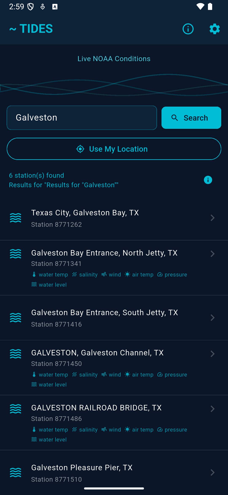
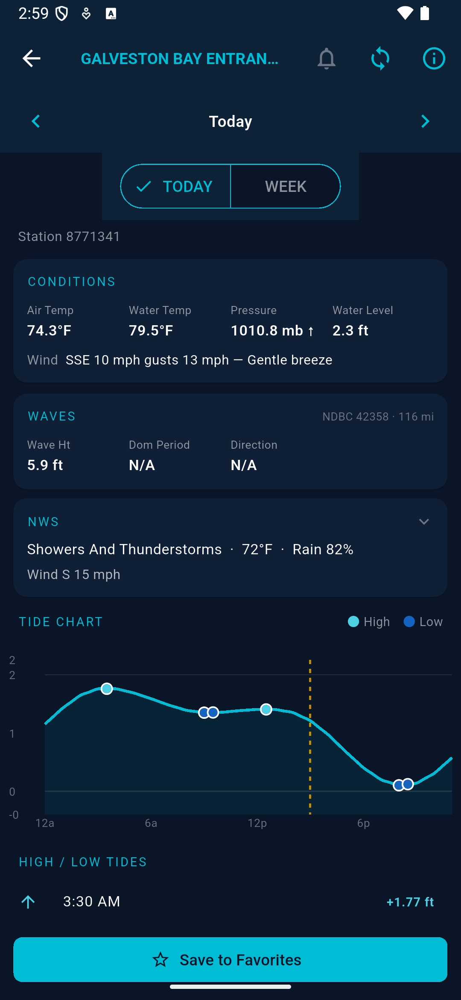
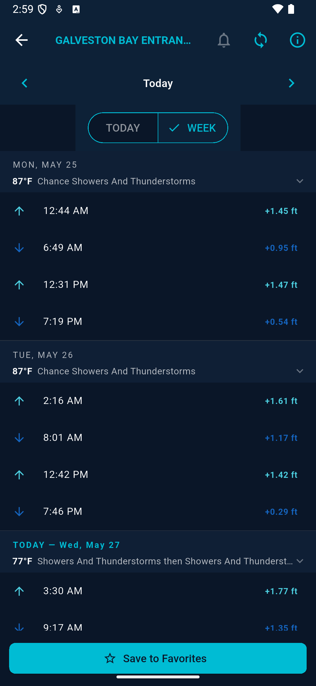
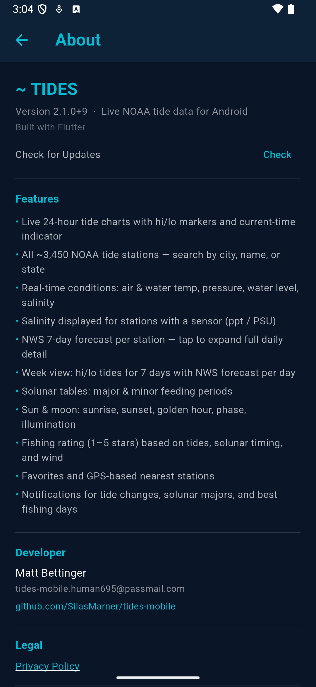

# Tides — Live NOAA Tide App for Android

A Flutter app for Android that shows real-time NOAA tide data, weather conditions, solunar tables, and fishing ratings. Built for fishermen and boaters who need quick, reliable tidal information on the water.

## Download

**[Latest release on GitHub Releases](https://github.com/SilasMarner/tides-mobile/releases/latest)** — download the `.apk` and tap to install.

To sideload: enable *Install unknown apps* for your file manager in Android Settings → Apps, download the APK, and tap to install.

---

## Changelog

### v2.1.0 (build 11) — latest
- **Alarm permission removed** — switched to inexact alarms; no special permissions required, notifications still fire accurately for tide and solunar events

### v2.1.0 (build 10)
- **Salinity icon fix** — corrected false-positive salinity badges; only the 21 NOAA stations with real salinity sensors now show the icon

### v2.1.0 (build 9)
- **Station sensor icons** — search results now show sensor badge icons (water temp, salinity, wind, air temp, pressure, water level) for every station that has them; fixed broken NOAA capability API calls
- **Current-time indicator** — amber dashed vertical line on the tide chart marks the current hour alongside the interactive slide bar

### v2.1.0 (build 7–8)
- **NDBC wave data** — wave height, dominant period, swell height/period/direction, wind sea; sourced from nearest buoy within 150 miles
- **Interactive tide chart** — tap or drag to see time + height readout anywhere on the curve
- **NWS fix** — forecast now shows for offshore/coastal stations that previously showed nothing (coordinate fallback)
- Privacy policy link in About screen
- sharkatthemoon.org community credit in About screen
- Exact version number shown in About screen
- Restored **Check for Updates** button in the About screen

### v2.0.0
- Full rewrite in Flutter (replaces Python/Kivy v1.x)
- Live 24-hour tide charts with hi/lo markers and current-time indicator
- All ~3,450 NOAA tide stations — search by city, name, or state
- Real-time conditions: air & water temp, pressure, water level, salinity
- NWS 7-day forecast per station with expandable daily detail
- Week view: hi/lo tides for 7 days with NWS forecast per day
- Solunar tables: major & minor feeding periods
- Sun & moon: sunrise, sunset, golden hour, phase, illumination
- Fishing rating (1–5 stars) based on tides, solunar timing, and wind
- Favorites and GPS-based nearest stations
- Tide change and solunar notifications

---

## Features

- **Live tide charts** — smooth cosine-interpolated curves with high/low dot markers and a current-time dashed line
- **All ~3,450 NOAA stations** — search by city, station name, or state
- **Subordinate stations** — cosine interpolation fills hourly data for stations that only publish hi/lo predictions
- **Real-time conditions** — air temp, water temp, barometric pressure (with trend ↑↓), water level, **salinity**
- **Salinity** — shown when the station has a sensor (PSU / ppt)
- **NWS weather** — current conditions + 7-day forecast per station; supplements missing NOAA sensor data
- **Week view** — 7 days of hi/lo tides with NWS temperature and short forecast per day; tap any day to expand the full detailed forecast
- **Solunar tables** — major/minor feeding periods calculated from moon position
- **Sun & moon** — sunrise, sunset, golden hour, moon phase and illumination percentage
- **Fishing rating** — 1–5 star rating based on tidal movement, solunar timing, and wind
- **NDBC wave data** — wave height, dominant period, swell height/period/direction, and wind sea from the nearest offshore buoy (up to 150 miles)
- **Interactive tide chart** — tap or drag anywhere on the chart to see exact time and height
- **Favorites** — save stations with one tap; shown on home screen
- **Use My Location** — GPS-based nearest stations

---

## Screenshots

| Search + Sensor Icons | Conditions · Waves · NWS · Chart | Week View | About |
|-----------------------|----------------------------------|-----------|-------|
|  |  |  |  |

---

## Tech Stack

| Layer | Technology |
|---|---|
| UI | Flutter 3.44+ / Material 3 |
| State | Riverpod (FutureProvider, StateProvider) |
| Charts | fl_chart |
| HTTP | Dio |
| Location | Geolocator |
| Storage | shared_preferences |
| Tide data | NOAA CO-OPS API |
| Weather | NWS weather.gov API |

---

## Building from Source

### Prerequisites
- Flutter SDK 3.44+
- Android SDK with API 35+
- Java 17

```bash
cd tides_flutter
flutter pub get
flutter build apk --release
```

### Debug (emulator x86_64)
```bash
flutter build apk --debug --target-platform android-x64
adb install build/app/outputs/flutter-apk/app-debug.apk
```

### iOS (requires macOS + Xcode)

The `ios/` directory is included and ready — bundle ID is already set to `com.mattbettinger.tides`.

```bash
cd tides_flutter
flutter pub get
cd ios && pod install && cd ..
flutter build ipa --release
```

Requires:
- macOS with Xcode 15+
- Apple Developer account ($99/year) for App Store / TestFlight distribution
- Free account works for sideloading to your own device via Xcode

For cloud builds without a Mac, [Codemagic](https://codemagic.io) can build both Android and iOS from the same repo (free tier: 500 min/month).

---

### Signed Android release build
Create `tides_flutter/android/key.properties` — **never commit this file**:

```properties
storeFile=../../tides.keystore
storePassword=YOUR_STORE_PASSWORD
keyAlias=tides
keyPassword=YOUR_KEY_PASSWORD
```

Then build the App Bundle for Play Store submission:
```bash
flutter build appbundle --release
# Output: tides_flutter/build/app/outputs/bundle/release/app-release.aab
```

---

## App ID

`com.mattbettinger.tides`

---

## Data Sources

Both APIs are free and require no API key:

- **NOAA CO-OPS API** — tide predictions, observations, water level, salinity  
  https://api.tidesandcurrents.noaa.gov/
- **NWS / weather.gov** — 7-day forecasts and hourly conditions  
  https://api.weather.gov/

---

## Project Structure

```
tides-mobile/
├── tides_flutter/       Flutter app (primary)
│   ├── lib/
│   │   ├── models/      Data models (TideData, Conditions, etc.)
│   │   ├── providers/   Riverpod state providers
│   │   ├── screens/     HomeScreen, DetailScreen, AboutScreen
│   │   ├── services/    noaa_api.dart, location_service.dart
│   │   └── widgets/     TideChart, ConditionsCard, StationTile
│   └── android/         Android build config
└── legacy/              Original Python/Kivy v1.2 (archived)
```

---

## Developer

Matt Bettinger — tides-mobile.human695@passmail.com

---

## License

MIT — free to use, modify, and distribute.
