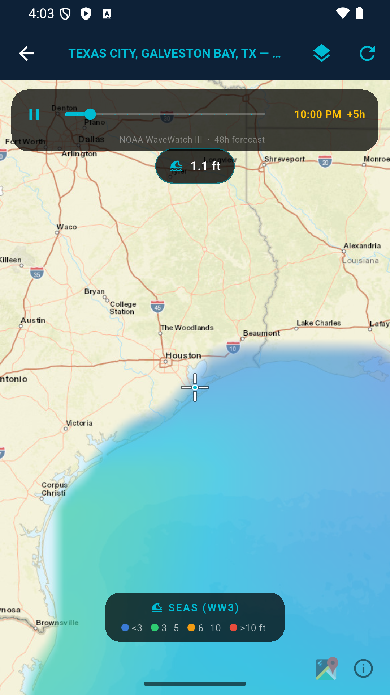
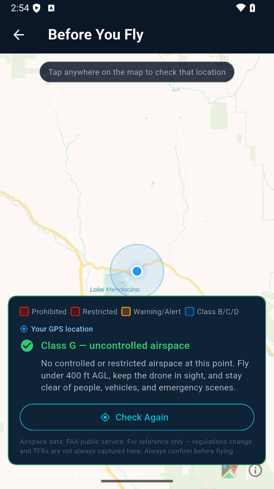
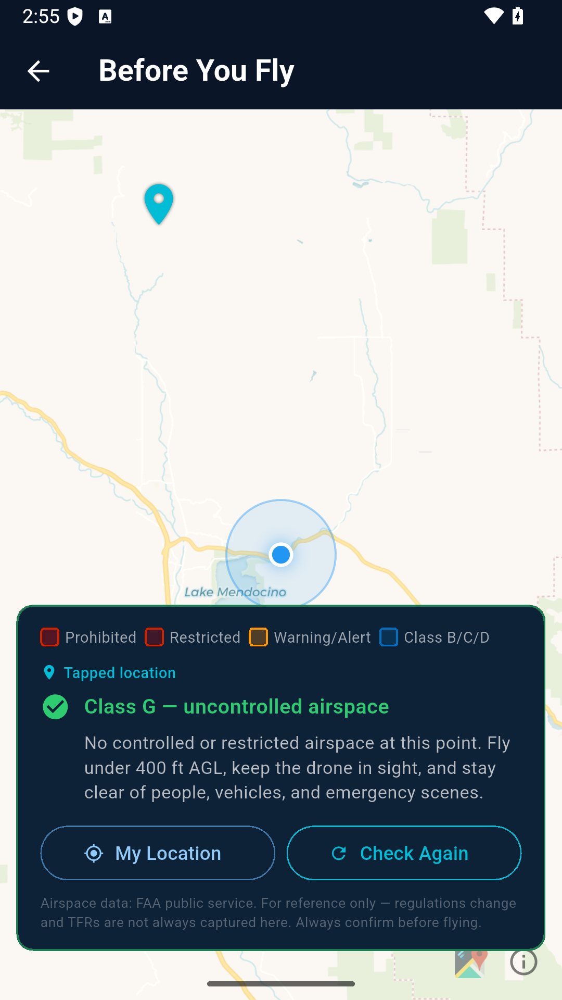
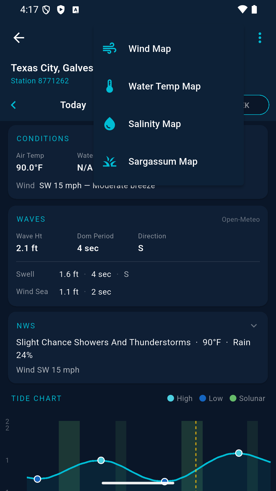
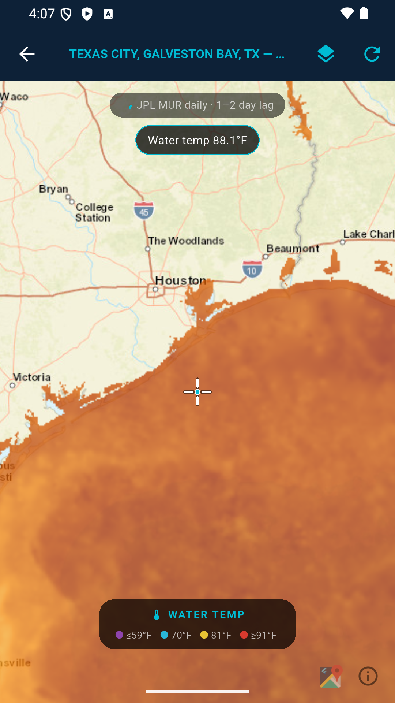
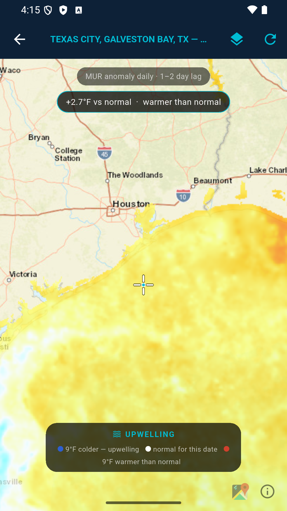
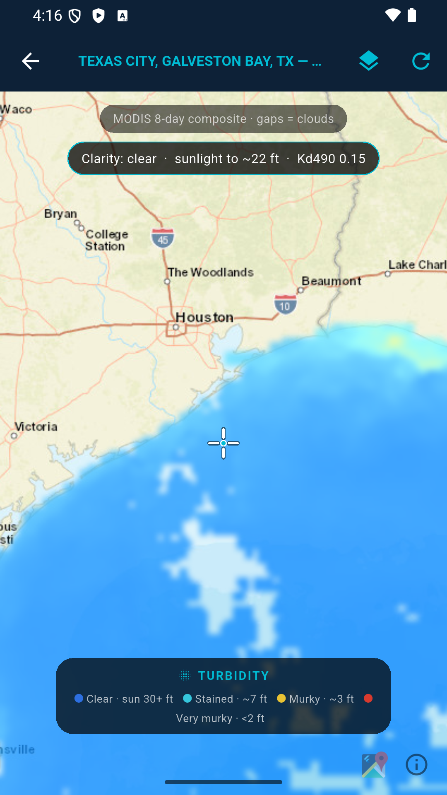
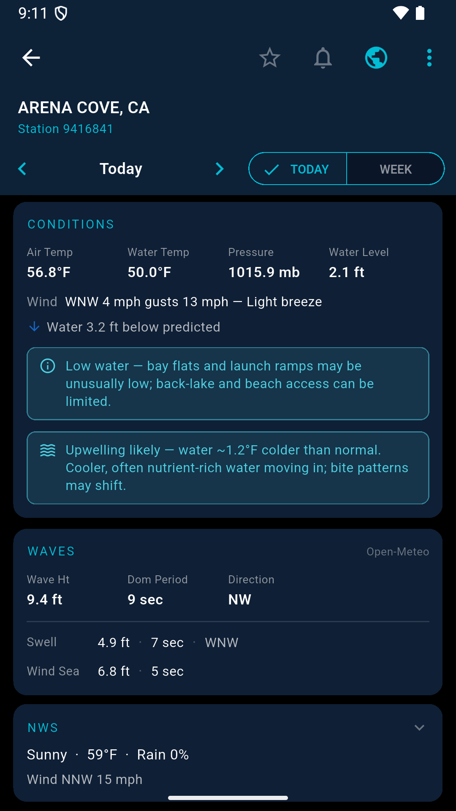
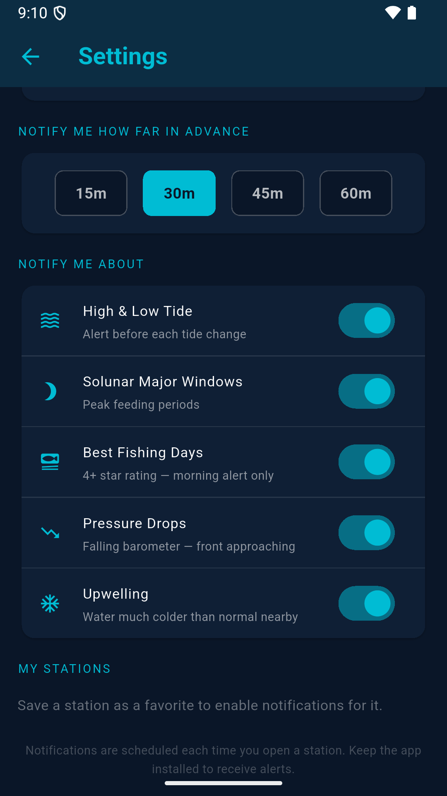

# OpenTides — free · open · forever

A free, open-source Flutter app for Android that shows real-time NOAA tide data, weather conditions, solunar tables, and fishing ratings. Built for fishermen and boaters who need quick, reliable tidal information on the water. No ads, no subscriptions, no data collection — free forever.

## Download

**Latest release: [v3.4.1 — Water Temp map, turbidity & upwelling alerts](https://github.com/SilasMarner/tides-mobile/releases/tag/v3.4.1)** ([always-latest link](https://github.com/SilasMarner/tides-mobile/releases/latest)) — download `tides-3.4.1.apk` and tap to install.

To sideload: enable *Install unknown apps* for your file manager in Android Settings → Apps, download the APK, and tap to install.

---

## Screenshots

### New in v3.4 — for Texas surf & bay anglers

| Wind-tide (water vs. predicted) | Bite forecast + best windows | In-app User Guide | Alerts (incl. cold-front) |
|------|------|------|------|
|  |  |  |  |

*The Conditions card now shows the **wind tide** — how far the live water level sits above/below the predicted tide (north winds drain the bays, south winds stack water in). The **Fishing** card folds tide movement, wind, and barometric trend into the star rating and lists today's best **bite windows**. A new **User Guide** (About → User Guide) explains the data sources and exactly how the score and alerts are calculated.*

| Home | Conditions & Waves (today) | Tides, Solunar & Moon |
|------|-------------------|----------------------|
|  |  |  |

| Future-day forecast (arrow to any day) |
|----------------------------------------|
|  |

*Conditions and Waves follow the day/week navigation — future days show that day's Open-Meteo forecast (tagged **Forecast · midday**); today shows live NOAA observations.*

### Weather map — native, Windy-style overlays

A fully custom map (no third-party embed): a smooth GPU gradient wash, animated
particle flow, and seven switchable layers. Tap anywhere to read the value at
that point; the data follows the map as you pan and zoom.

| Wind (gradient + particles) | Layer picker | Swell |
|------|-------------|-------|
|  |  |  |

| NOAA radar → forecast timeline | Pressure isobars | Temperature + tap-to-read |
|-----------------|------------------|---------------------------|
|  |  |  |

| Seas — NOAA WaveWatch III | Hourly forecast strip |
|---------------------------|-----------------------|
|  |  |

| Sargassum Map (NOAA SIR — daily coastal inundation risk) |
|----------------------------------------------------------|
|  |

### New in v3.4.1 — Before You Fly (drone airspace check)

Tap the **takeoff icon** in the home screen toolbar to open the Before You Fly screen. It queries the **FAA's public airspace service** directly — no third-party apps, no account needed.

- Colored **airspace overlays** cover the full map viewport: solid red = Prohibited, lighter red = Restricted, orange = Warning/Alert, blue = Class B/C/D controlled airspace.
- **Tap anywhere on the map** to check airspace at that exact point — a cyan pin drops and the status card shows the result for that location. Tap **My Location** to return to your GPS status.
- The overlay updates as you pan and zoom, so you can explore nearby airspace before heading out.

| Airspace clear (GPS location) | Tap-to-check any location |
|-------------------------------|---------------------------|
|  |  |

---

### New in v3.4.1 — Water Temp map, turbidity & upwelling alerts

A new **Water Temp** map renders NOAA CoastWatch data straight onto the
pannable map — pick a layer and the data follows the map as you move:

- **Water Temp** — sea-surface temperature gradient from JPL MUR (1 km, daily).
- **Upwelling** — SST *anomaly* vs. normal; blue = colder-than-normal water, the classic upwelling signal.
- **Turbidity** — MODIS Kd490 water clarity (8-day composite), clear vs. murky water at a glance.

All four maps now live under one **globe menu** on the station screen. When the
water near your station runs well colder than normal, the Conditions card shows
an **Upwelling likely** advisory and (if enabled) a once-a-day notification —
cooler, often nutrient-rich water moving in is a bite-pattern changer.

| Maps menu | Water Temp (NOAA/JPL MUR SST) | Upwelling (SST anomaly) |
|-----------|-------------------------------|--------------------------|
|  |  |  |

| Turbidity (MODIS Kd490) | Upwelling advisory + alert | Alert toggle |
|--------------------------|----------------------------|--------------|
|  |  |  |

### Units & Night mode

| Standard / Metric toggle |
|--------------------------|
|  |

**Night mode** — tap the moon icon in the top bar of the home screen for a high-contrast night theme: the navy background becomes pure black and the text and cyan accents brighten, so the screen is easier to read in the dark (before dawn or after sunset) with less glare. The choice is saved and applies across the whole app.

| Salinity Map (NOAA NGOFS2 forecast loop) |
|------------------------------------------|
|  |

---

## Android Auto

OpenTides runs on **Android Auto** head units as part of the same app — one install, no separate download. When the phone connects to a car, OpenTides appears in the car launcher and shows a glanceable, driver-safe view:

- **Favourites list** — your saved stations, read straight from the phone app (no re-setup, no location permission needed).
- **Station screen** — a rendered **tide-chart image** for today (curve, high/low dots, current-time line), the next high & low, live conditions (water temp, wind), and the phone-computed fishing rating and sun/moon when available. A Refresh action re-pulls live data.

Android Auto only permits simple, safety-approved templates, so the car view can't project the phone's interactive maps or live charts — it's a focused at-a-glance version (the chart is drawn to an image since custom widgets can't run on the car display). Built natively with Google's Car App Library; the car service is **dormant until you connect to a car**, so there's zero impact on the phone app and only ~0.1 MB added to the download.

---

## Changelog

### v3.4.1 (build 88) — User Guide: Before You Fly section updated
- **In-app User Guide** updated to document the viewport overlay (colored zone tints across the full map), the tap-to-check feature (cyan pin + per-point FAA query), color legend (prohibited / restricted / warning / controlled), and the My Location reset button. Tips bullet updated to match.

### v3.4.1 (build 87) — Before You Fly: tap-to-check any location
- **Tap anywhere on the map** to query FAA airspace at that exact point. A cyan pin drops on the tapped location, the status card updates with the result (prohibited / restricted / controlled / clear), and a label distinguishes "Tapped location" from "Your GPS location." The "My Location" button resets back to the GPS status; "Check Again" re-runs the full GPS load.
- A hint banner above the map prompts the user to tap before they've tried it.

### v3.4.1 (build 86) — Before You Fly: viewport airspace overlay
- **Airspace map overlay** — the Before You Fly screen now queries the FAA by the current map *viewport* (bounding box) rather than just the user's GPS point, so restricted/prohibited zones are drawn as colored tints across the entire visible map area. Red tint = prohibited (no fly). Lighter red = restricted. Orange = warning/alert. Blue = controlled (Class B/C/D, FAA authorization required). A small spinner in the AppBar indicates when a new viewport query is in flight. Panning or zooming the map re-fetches the overlay after a short debounce, so the zones follow the map as you explore.
- **Legend** — a scrollable chip row in the status card labels each color category.

### v3.4.1 (build 85) — Before You Fly: fully self-contained, no third-party links
- **Before You Fly** — removed the "Open B4UFLY" button and all third-party references. The screen now does everything in-app: GPS location → FAA ArcGIS REST query → airspace status + polygon overlay on the map. No external apps, no Play Store links, no redirects. Clear / controlled / restricted status is displayed with the FAA zone geometry drawn directly on the map. Disclaimer updated to reference the FAA NOTAM system instead of B4UFLY.
- **User Guide** updated to match — the Before You Fly section now describes the FAA-direct flow and lists the plain-English rules for each airspace class.

### v3.4.1 (build 84) — Before You Fly (drone airspace check)
- **Before You Fly** — new screen accessible from the home screen toolbar (airplane-takeoff icon). Gets your GPS location, queries the FAA's public ArcGIS airspace service, and shows whether you're in Class G (clear to fly under 400 ft AGL), controlled airspace (FAA authorization required), or restricted/prohibited airspace. Renders the airspace zone polygons directly on the map when the FAA query returns geometry.

### v3.4.1 (build 83) — Notification toggle fix
- **Notification toggle** — enabling Tide Notifications in Settings now works correctly. The toggle was calling `requestPermission()` which launches an Android system permission dialog and then awaits its response indefinitely, preventing `setEnabled()` from ever running. The permission request is already handled by the red "Notifications are blocked" banner's Allow button; removed the redundant call from the toggle handler.

### v3.4.1 (build 81) — Notification icon + settings stability
- **Notification icon** — the wave icon now appears correctly in the Android status bar on Play Store installs. Release builds were silently stripping the icon drawable (it was referenced by string in Dart, invisible to Android's resource shrinker); a `res/raw/keep.xml` rule now preserves it. This was the root cause of blank icons and failed notification delivery on AAB installs.
- **Settings screen** — the notification settings screen no longer gets stuck on a permanent spinner if the alert system hits an error; it falls back to safe defaults and remains usable.
- **Alert init guard** — if the notification plugin fails to initialize (e.g. corrupted cache), the app recovers gracefully instead of throwing on every subsequent call.

### v3.4.1 (build 79) — Zero enrolled stations fix
- **Settings showed 0 alerts** even when stations were configured — `rescheduleAllStations()` wrote auto-enrolled stations directly to SharedPreferences but Riverpod never saw the write. The Settings screen now re-reads from disk after rescheduling, showing the correct enrolled count immediately.

### v3.4.1 (build 78) — User Guide: notifications section updated
- **In-app User Guide** — the Alerts & notifications section now reflects the current auto-enrollment model: all favorites enrolled automatically, per-station toggles available in Settings, 7-day scheduling window, and the Alarms & Reminders permission note for Android 12+.

### v3.4.1 (build 77) — Settings: scheduled alert count + reschedule button
- **Pending count** — Settings now shows how many alerts are currently scheduled (e.g. "42 alerts pending over the next 7 days").
- **Reschedule now** — a manual button forces an immediate 7-day re-fetch and reschedule without restarting the app.
- Tide alerts **confirmed working on a real Pixel phone** — Galveston high and low tide notifications arriving correctly.

### v3.4.1 (build 76) — Notification wave icon
- **Status-bar icon** — replaced the launcher icon with a white-on-transparent wave symbol (`ic_notification`). Android requires alpha-only icons for status-bar notifications; using the full-colour launcher icon produced a white box.

### v3.4.1 (build 75) — Alert delivery fix for release builds
- **Root cause fixed** — alerts were scheduling correctly in debug builds but silently failing on Play Store installs. The R8 release optimiser was stripping Gson `TypeToken` type signatures that the notification library needed to deserialise stored alerts. A ProGuard rule now preserves them across release builds.

### v3.4.1 (build 74) — Stale notification cache fix
- **FLN cache wipe on init** — older notification library versions stored scheduled-notification records without a required `"type"` field; on upgrade, every scheduling call threw "Missing type parameter". The app now wipes the stale cache at startup via a native Kotlin channel before the plugin initialises.

### v3.4.1 (build 72) — Auto-enroll favorites for alerts
- **Auto-enrollment** — enabling notifications now automatically enrolls all saved favorites — no need to toggle each station individually. Adding a new favorite while notifications are already on enrolls it immediately.

### v3.4.1 (build 61) — Exact alarm permission + alert cancellation fix
- **Exact alarm timing** — re-added `SCHEDULE_EXACT_ALARM` so alerts fire on time. Without it, Android Doze mode was deferring alerts by hours or indefinitely on real devices (the emulator grants exact alarms unconditionally, masking the issue in testing).
- **Permission banner** — when the exact alarm permission hasn't been granted, an amber "Alerts may be delayed — Fix" banner appears in Settings with a one-tap link to the system Alarms & Reminders page. The banner auto-dismisses when you return after granting.
- **Cancel-by-station fix** — canceling alerts for a specific station now works correctly. The station ID payload was missing from scheduled notifications, so cancel-by-station lookups always matched zero entries.

### v3.4.1 (build 59) — **Water Temp map speed + polish**
- **Instant open** — tapping the Water Temp map icon now pre-warms the SST overlay in the background, so the map opens with data already painted (no loading spinner on first open).
- **Instant layer switching** — visited layers (Water Temp / Upwelling / Turbidity) are cached for the session; switching back is immediate instead of waiting for a fresh ERDDAP render.
- **Smarter panning** — small pans within the already-loaded region skip the ERDDAP refetch entirely; only moves that leave the loaded area trigger a new request.
- **"Tap the map to read a value"** hint chip appears once the overlay loads, matching the Wind map's discoverability cue.
- **Probe marker** — the tap-point indicator is now a small cyan circle (matching the Wind map), replacing the plain white icon that looked like a stray artifact.

### v3.4.1 (build 59) — **Tap-to-read on the Water Temp map + clearer legends**
- **Tap anywhere** on the Water Temp, Upwelling, or Turbidity layer to read the exact value at that spot — water temperature, °F/°C above/below normal (with an *upwelling signal* note when it qualifies), or water clarity with the approximate depth sunlight reaches. The reading is pulled live from the same NOAA grid cell the map color came from; tap the chip to dismiss.
- **Descriptive legends** — the Turbidity legend now shows the approximate sunlight-penetration depth per band (e.g. *Clear · sun 30+ ft* … *Very murky · <2 ft*, metric-aware), and the Upwelling legend reads plainly (*9°F colder — upwelling / normal for this date / 9°F warmer than normal*).
- **In-app docs** — the User Guide's "Water temp, upwelling & turbidity" section now explains how each layer is computed (JPL MUR blended satellite+buoy SST; anomaly = today minus the long-term normal for that spot and day of year; Kd490 light attenuation with sunlight depth ≈ 1 ÷ Kd490) and covers the new tap-to-read probe.

### v3.4.1 (build 58) — **Water Temp map, turbidity & upwelling alerts**
- **Water Temp map** — a new three-layer ocean map from NOAA CoastWatch ERDDAP (free, no key): **sea-surface temperature** gradient (JPL MUR, 1 km daily), **upwelling** (SST anomaly vs. normal — blue = colder-than-normal water), and **turbidity** (MODIS Kd490 8-day water clarity). Server-rendered overlays follow the map as you pan/zoom, with per-layer legends (°F/°C aware), a data-age chip, and a friendly retry when NOAA is slow.
- **Upwelling advisory + alert** — when the daily SST anomaly near a station drops 1.5 °C or more below normal, the Conditions card shows an *Upwelling likely* heads-up, and stations with notifications enabled get a once-a-day alert (new per-alert toggle in Settings). Cold anomalies can also follow fronts, so the wording stays honest ("likely").
- **Maps menu** — the wind, water-temp, salinity and sargassum maps now live under a single globe icon on the station screen, so the toolbar doesn't crowd on narrow phones.
- **Readable turbidity** — blue = clear, cyan→yellow→red = murkier, and the 4 km satellite grid is smoothed into a continuous wash instead of hard pixels.
- Refresh on the station screen now also re-pulls the SST anomaly; the in-app User Guide gained a "Water temp, upwelling & turbidity" section.

### v3.4.0 (build 55) — **Map tune-up: cleaner coasts, smoother open**
- **No waves on land** — the Seas (WaveWatch III) layer now carries a water-coverage mask, so the wash follows the coastline with a soft edge instead of bleeding onto land.
- **Works on every coast** — robust longitude handling (incl. the antimeridian) and graceful empty-view behavior; verified on the Gulf and the Pacific.
- **Smoother open** — tapping the weather-map icon now prefetches the default Wind layer's data and the basemap tiles around the station, and the map caches grids per session, so opening it (and switching layers) is near-instant instead of showing a spinner over grey tiles.
- **Crisper offshore detail** — higher-resolution Seas render; also fixes the gradient overlay so layers draw their full field.

### v3.4.0 (build 54) — **Seas (NOAA WaveWatch III) map layer**
- **New Seas layer** — a smooth, animated offshore **significant-wave-height** map from NOAA's WaveWatch III model (via the PacIOOS ERDDAP mirror), in the spirit of StormSurf's Gulf sea-height charts. Opens at a wide offshore view, steps through the next ~48 hours of forecast (play/scrub), and reads wave height in ft/m on tap. Vivid blue→green→yellow→red colour ramp so sea state pops; land is masked out.
- **Sharper map gradients** — fixed the weather-map overlay so each layer now draws its full interpolated field instead of stretching a small corner of it; Wind, Waves, Temperature, etc. all render with correct spatial detail.

### v3.4.0 (build 53) — **Faster reopen + wind-tide advisory + Email the author**
- **Tide data survives a restart** — previously-viewed days are now mirrored to disk, so reopening the app after Android has evicted it from memory serves them instantly instead of re-fetching every day you scrub to. Tide predictions are astronomical and never change, so the cache is safe to persist; today's live conditions still refresh on their own short timer, and the days around a station you open are warmed in the background (favorites and the station you just tapped). Coming back to the foreground also refreshes favorites' current conditions.
- **Wind-tide advisory** — when wind has stacked water **1 ft or more above** the predicted tide, the Conditions card now adds a heads-up that beach driving and access may be limited and water is stacking into the bays; the opposite case (water drained **1 ft or more below** predicted) warns that bay flats and launch ramps may be unusually low. Works for any station with a live water-level reading.
- **Email the author** — the About screen now has an *Email the author* button that opens your mail app pre-addressed to the project contact, with a subject line filled in.

### v3.4.0 (build 52) — **Fuller Android Auto screen**
- **More on the car screen** — the Android Auto station view now also shows the **best bite times** and the tide-movement line, a rendered **moon-phase picture**, and sun times, alongside the existing tide-chart image, next high/low, and live conditions. The fishing/sun/moon figures are computed on the phone and shared to the car; the moon disc is drawn from the phase + percent illuminated.

### v3.4.0 (build 51) — **TODAY button fix**
- **TODAY returns to the current day** — on the station detail screen, after using the date arrows, tapping TODAY now snaps back to today's chart (it previously did nothing because the segment was already selected and only changed the view mode).

### v3.4.0 (build 50) — **Richer Android Auto + smoother clouds**
- **Android Auto station screen** — a rich pane with a rendered **tide-chart image** for today (curve + high/low dots + current-time line), the next high & low, live conditions (water temp, wind), and the fishing rating and sun/moon (computed on the phone and shared to the car). Since Android Auto can't run custom widgets, the chart is drawn to a bitmap on the phone and shown as an image — about as close to the phone view as the platform allows.
- **Smooth cloud (satellite) playback** — the Clouds layer now uses the same technique as the rain radar: each GOES-East frame is fetched as one composited GIBS image over the visible area and pre-cached before the loop starts, so the satellite animation swaps pre-decoded frames instead of re-tiling per step. No more stop-and-go. The cloud loop also follows the map when you pan/zoom.

### v3.4.0 (build 48) — **Android Auto + Night mode**
- **Android Auto support** — OpenTides now appears on Android Auto car displays (same app, one install). Shows your favourite stations and the next high/low tides for any of them, fetched live from NOAA — glanceable and driver-safe. Built with Google's Car App Library; the car service stays dormant until you connect to a car, so it adds no phone-runtime cost and ~0.1 MB to the app.
- **High-contrast night mode** — a moon toggle in the home-screen top bar switches the app to a pure-black, brighter-accent theme that's easier to read in the dark with less glare. Saved across sessions and applied app-wide.
- **User Guide updated** — the in-app guide now documents both night mode and Android Auto.

### v3.4.0 (build 46) — **Texas angler features + User Guide**
- **Wind-tide indicator** — the Conditions card now shows the live water level vs. the predicted tide ("Water 0.7 ft below predicted"). On the Texas coast this reveals wind setup: north winds drain the bays and back-lakes (below prediction), south winds stack water in (above). Today only, on stations with a live water-level sensor. Computed from data already fetched — no new API.
- **Smarter fishing score + best windows** — the 1–5 star rating now folds in **moving water** (the tide's rate of change vs. the day's strongest), a **falling-barometer** bump (fish feed ahead of fronts), and the existing solunar + wind factors. The Fishing card adds a movement line ("Incoming — strongest 2–4 PM") and today's top 2–3 **bite windows**.
- **Cold-front alert** — a new *Pressure Drops* notification fires when the barometer is falling (a front approaching, often a strong pre-front bite). Once per day per station, reusing the existing alert framework.
- **In-app User Guide** — a new *User Guide — how it works* button on the About page opens a plain-language guide: where the data comes from (NOAA CO-OPS, NWS, Open-Meteo Marine, on-device solunar/sun/moon), how to read the tide chart and wind tide, exactly how the fishing score and best windows are calculated, and how each alert type fires.

### v3.3.0 (build 44)
- **Station pin on all wind map layers** — a cyan location pin marks your station on every wind map layer (Wind, Waves, Swell, Rain, Temperature, Pressure, Clouds). Visible over both the light basemap and the dark satellite view thanks to a black + white shadow.

### v3.3.0 (build 43) — **OpenTides rebrand**
- **Renamed to OpenTides** — the app is now called *OpenTides* with the tagline *free · open · forever*, reflecting its open-source, always-free identity.
- **New launcher icon** — same navy night sky / crescent moon / cyan waves design language, updated with the OpenTides name and tagline across all Android screen densities.
- **About screen** updated to match: *"~ OpenTides · Version 3.3 · free · open · forever"*.

### v3.3.0 (build 42)
- **Extended date prefetch** — favorites are now prefetched across a **10-day window** (2 days back + today + 7 days ahead) on startup. The full week-forward and 2-day-back navigation on any favorite is instant after background fetches complete.

### v3.3.0 (build 41)
- **Faster date navigation** — on startup the app prefetches tide/weather data for each favorite station across a 5-day window (yesterday + today + 3 days ahead). Tapping the forward/back arrows on a favorite is instant after the background fetch completes. Non-today dates use a 6-hour cache TTL (tide predictions don't change intra-day); today keeps the existing 30-minute TTL for live conditions.

### v3.3.0 (build 40)
- **Wind map resilience during outages** — when Open-Meteo's weather service is unreachable, the wind map now falls back to the last successfully loaded grid and shows an amber banner: *"Open-Meteo down · last data Xm ago · tap to retry"*. The map stays useful during short outages instead of going blank.
- **Better error messages** — the wind map now distinguishes between a service outage (*"Open-Meteo is temporarily down — try again in a few minutes"*), a network timeout (*"Request timed out — check your connection"*), and no data at a location, instead of the generic "Could not load data".

### v3.3.0 (build 39)
- **Softer update-check message** — when the Play Store has no update ready (e.g. a build was just uploaded and hasn't propagated yet), the message now reads *"Nothing available right now — try again later"* instead of the alarming "Could not check for updates".

### v3.3.0 (build 38)
- **Sargassum Map screen** — dedicated 🌿 button in the detail toolbar opens a full-screen NOAA SIR (Sargassum Inundation Risk) map showing daily coastal sargassum risk for the Gulf Coast, Caribbean, and tropical Atlantic. Auto-picks the nearest region (Gulf of America, Central America, Greater Antilles, Lesser Antilles, or South America); tap the region chip to switch. Pinch-zoom up to 6× for coastline detail. Updated daily. Free, no API key (NOAA AOML / USF Optical Oceanography Lab).
- **30-minute data cache** — NOAA tide/NWS/wave data is cached in memory with a 30-minute TTL; re-opening a station within a session is instant instead of a 5–7 s spinner.
- **Favorites prefetch on startup** — when the app launches and you have favorites, their tide data is fetched in the background so tapping a favorite is instant.

### v3.3.0 (build 35)
- **Clouds layer → real animated satellite.** The Clouds layer was a near-invisible modeled cloud-cover wash that didn't reflect actual weather. It's now **live NASA GIBS / GOES-East clean-infrared satellite** — real cloud tops, with deep convection / storm anvils glowing green→orange→red. It animates on a **timeline play bar** (NOW, play/pause, scrub) over ~2 h of 10-minute frames, like the radar. Rendered over a dark basemap with a screen blend so clouds and storms pop and clear sky stays transparent.
- **Bright coastline overlay** on the satellite view — the coast, bays, rivers and state lines are drawn in cyan on top of the clouds, so you can see exactly where a cell is relative to your bay or beach. Free, no API key (NASA GIBS · NOAA GOES · Esri).

### v3.3.0 (build 34)
- **Check for Updates fix** — the in-app updater downloaded a new build but never installed it (it was missing the final `completeFlexibleUpdate()` step, so "restart the app" did nothing). It now shows an **Install** button once the download finishes, which applies the update and restarts into the new version. Sideloaded builds get a clear "update via Google Play" message instead of a dead "downloading" state.

### v3.3.0 (build 33)
- **Conditions & Waves now follow the day/week navigation** — for any day other than today, the Conditions and Waves cards show that day's forecast (Open-Meteo land + marine, sampled at midday) instead of staying stuck on today's live readings. Today still shows live NOAA observations. Cards are tagged *Forecast · midday* / *Open-Meteo forecast*.
- **Map legend fix** — the weather-map legend now sits above the system navigation/gesture bar (was clipped on Samsung devices).
- Thanks to **SGrem** for the detailed feedback that prompted both fixes. 🎣

### v3.3.0 — (NOAA radar + unified rain timeline)
- **NOAA MRMS radar** — the Rain layer's live/observed portion now renders NOAA's MRMS composite reflectivity (`conus_cref_qcd`) via WMS — the same full-resolution, ~2-minute-cadence national radar mosaic the major weather apps show. Free, no API key, US coverage. Replaces RainViewer.
- **Unified rain timeline** — one scrubbable timeline flows seamlessly from ~2 h of observed NOAA radar, through *now*, into an 18 h precipitation forecast. No mode toggle; a **NOW** button jumps back to the current frame.
- **Hourly forecast strip** — a scrollable bottom strip shows the next 18 h: weather icon, temperature, and rain probability per hour (Open-Meteo).
- **Smoother forecast overlay** — the forecast precipitation grid was densified (16×16) and is rendered at 128 px with bilinear interpolation, so it reads as smooth precipitation instead of blocky patches.
- **Fishing rating on every day** — the Fishing card now appears for future days too (a solunar-vs-tide alignment score), not just today.
- **Detail header cleanup** — full station name + ID always visible in a banner; date arrows and the TODAY/WEEK toggle share one compact row.

### v3.2.0 (build 30)
- **Hourly forecast strip** added to the Rain forecast view (weather icon · temp · rain %, 18 h ahead).
- **Fishing rating shown for all days**, not only today.

### v3.1.0 (build 28)
- **Rain forecast mode** — a LIVE/FCST toggle (since superseded by the unified timeline in 3.3) added an 18 h Open-Meteo precipitation forecast alongside the live radar.
- **Detail screen** station header redesigned (full name + ID banner, merged nav row).

### v3.0.0 (native-maps rewrite)
- **Native weather map** — replaced the Windy embed with a fully custom Flutter map (flutter_map + Open-Meteo, no third-party branding or WebView): a smooth GPU-scaled gradient wash plus an animated particle flow rendered with a `CustomPainter`
- **Seven layers** — Wind, Waves, Swell, Rain, Temperature, Pressure, Clouds, chosen from a bottom-sheet layer picker; each with its own colour ramp and legend
- **Live rain radar** — the Rain layer shows real weather radar (RainViewer) with an animated, scrubbable timeline (~2 h of frames) and a play/pause control
- **Pressure isobars** — Windy-style labelled contour lines drawn with marching squares; the view zooms out so the synoptic pattern is visible
- **Tap-to-read** — tap anywhere on any layer to read the interpolated value (speed/height + compass direction for vector layers), unit-aware
- **Data follows the map** — the overlay grid re-fetches to cover the visible area as you pan/zoom, so there's no hard overlay edge
- **Units setting** — Standard (°F · mph · ft) or Metric (°C · km/h · m) in Settings; applies across the map, detail screen, tide chart, and notifications
- **Solunar bands on the tide chart** — shaded green feeding-period bands (wider/brighter majors, narrower/fainter minors), like the dashboard
- **Reorder favorites** — drag the ≡ handle on any favorite to reorder your list (long-press still removes, tap still opens)
- **Salinity map** — the native NOAA NGOFS2 surface-salinity loop (water-drop toolbar icon) carried over from main: play/pause + scrub timeline, pinch-zoom, auto-selected Gulf region, and an out-of-coverage notice for non-Gulf stations

### v2.3.0 (build 19)
- **Reorder favorites** — drag the ≡ handle on any favorite to reorder your list; the order is saved. Long-press still removes a favorite and tap still opens it.

### v2.3.0 (build 18)
- **Week view fix** — the 7-day view now rolls forward from today instead of starting on the calendar-week Monday (which showed mostly past days, with mismatched NWS forecasts, late in the week)
- **Station name on detail** — the full station name now appears in the detail body (the app-bar title truncates when several toolbar actions are present)
- **Salinity out-of-area handling** — opening the salinity map for a station outside NGOFS2's Gulf coverage now shows a clear "covers Gulf of America bays" message with a *Browse Gulf regions* option, instead of a misleading out-of-area map

### v2.3.0 (build 17)
- **Salinity map** — animated NOAA NGOFS2 (Northern Gulf OFS) hourly surface-salinity forecast loop, opened from the water-drop icon in any station's toolbar. Play/pause + scrub timeline, pinch-to-zoom, and a region picker that auto-selects the Gulf bay nearest the station (Galveston, Matagorda, Corpus Christi, Sabine, Calcasieu, Mobile, Pascagoula, and a whole-Gulf overview)

### v2.3.0 (build 15)
- **Wind map upgrade** — switched to Windy embed2 for full color gradient overlay, animated wind particle flow, isobar pressure lines, and a forecast timeline scrubber at the bottom
- **Wind map layers** — expanded overlay menu adds Swell and Pressure; active overlay shows a checkmark
- **Wind map** — initial Windy map screen accessible from any station's detail view via the wind icon in the toolbar

### v2.2.0 (build 12–14)
- **Open-Meteo Marine wave data** — replaces NDBC buoy; wave height, dominant period, swell and wind-sea breakdown at exact station coordinates
- **Play Store in-app update prompt** — app checks for updates on launch; shows a banner when a new version is ready to install; "Check for Updates" in About screen queries Play Store directly
- Moon phase display overflow fix

### v2.1.0 (build 11)
- **Alarm permission removed** — switched to inexact alarms; no special permissions required, notifications still fire accurately

### v2.1.0 (build 10)
- **Salinity icon fix** — only the 21 NOAA stations with real salinity sensors show the badge

### v2.1.0 (build 9)
- **Station sensor icons** — sensor badge icons in search results for water temp, salinity, wind, air temp, pressure, water level
- **Current-time indicator** — amber dashed line on tide chart marks the current hour

### v2.1.0 (build 7–8)
- **Interactive tide chart** — tap or drag to see time + height readout anywhere on the curve
- **NWS fix** — forecast now works for offshore/coastal stations via coordinate fallback

### v2.0.0
- Full rewrite in Flutter (replaces Python/Kivy v1.x)
- Live 24-hour tide charts with hi/lo markers
- All ~3,450 NOAA tide stations — search by city, name, or state
- Real-time conditions: air & water temp, pressure, water level, salinity
- NWS 7-day forecast per station with expandable daily detail
- Week view: 7 days of hi/lo tides with NWS forecast
- Solunar tables: major & minor feeding periods
- Sun & moon: sunrise, sunset, golden hour, phase, illumination
- Fishing rating (1–5 stars) based on tides, solunar timing, and wind
- Favorites and GPS-based nearest stations
- Tide change and solunar notifications

---

## Features

- **Live tide charts** — smooth cosine-interpolated curves with high/low dot markers and a current-time dashed line
- **All ~3,450 NOAA stations** — search by city, station name, or state
- **Real-time conditions** — air temp, water temp, barometric pressure (with trend ↑↓), water level, salinity
- **Wave data** — wave height, dominant period, swell height/period/direction, and wind sea from Open-Meteo Marine at each station's exact coordinates
- **NWS weather** — current conditions + 7-day forecast per station
- **Week view** — 7 days of hi/lo tides with NWS temperature and short forecast; tap any day to expand
- **Solunar tables** — major/minor feeding periods calculated from moon position
- **Sun & moon** — sunrise, sunset, golden hour, moon phase and illumination percentage
- **Fishing rating** — 1–5 star rating based on tidal movement, solunar timing, and wind; shown for every day (future days use a solunar-vs-tide alignment score)
- **Interactive tide chart** — tap or drag anywhere to see exact time and height
- **Weather map** — a native, Windy-style map (no third-party embed) with a smooth gradient wash and animated particle flow. Seven layers: **Wind, Waves, Swell, Rain, Temperature, Pressure, Clouds**
  - **NOAA radar → forecast** — a unified scrubbable timeline: ~2 h of NOAA MRMS composite-reflectivity radar flows through *now* into an 18 h precipitation forecast, with a NOW button and an hourly strip (icon · temp · rain %)
  - **Pressure isobars** — labelled contour lines, synoptic-scale view
  - **Tap-to-read** — tap anywhere to read the value (and direction) at that point
  - **Follows the map** — the overlay re-fetches to cover wherever you pan or zoom
- **Units** — Standard (°F · mph · ft) or Metric (°C · km/h · m), applied everywhere
- **Salinity map** — animated NOAA NGOFS2 surface-salinity forecast loop for Gulf bays, with play/pause timeline, pinch-zoom, and an auto-selected region picker
- **In-app updates** — automatically checks for Play Store updates on launch; prompts with RESTART / LATER banner when ready
- **Favorites** — save a station by long-pressing it in the list (or the star on the detail screen); shown on the home screen, drag the ≡ handle to reorder, long-press to remove
- **Use My Location** — GPS-based nearest stations
- **Notifications** — alerts for tide changes, solunar majors, and best fishing days

---

## Tech Stack

| Layer | Technology |
|---|---|
| UI | Flutter 3.44+ / Material 3 |
| State | Riverpod (FutureProvider, StateProvider) |
| Charts | fl_chart |
| HTTP | Dio |
| Location | Geolocator |
| Storage | shared_preferences |
| Tide data | NOAA CO-OPS API |
| Weather | NWS weather.gov API |
| Wave data | Open-Meteo Marine API (CC BY 4.0) |
| Weather map | flutter_map + latlong2 · custom `CustomPainter` gradient & particles |
| Map forecast | Open-Meteo forecast & marine APIs |
| Rain radar | NOAA MRMS composite reflectivity via WMS (NCEP GeoServer, free, no key) |
| Basemap tiles | CARTO Voyager (© CARTO, © OpenStreetMap) |
| Salinity map | NOAA NGOFS2 OFS forecast plots (tidesandcurrents CDN) |
| Updates | Google Play In-App Update API |

---

## Building from Source

### Prerequisites
- Flutter SDK 3.44+
- Android SDK with API 35+
- Java 17

```bash
cd tides_flutter
flutter pub get
flutter build apk --release
```

### Debug (emulator x86_64)
```bash
flutter build apk --debug --target-platform android-x64
adb install build/app/outputs/flutter-apk/app-debug.apk
```

### Signed Android release build
Create `tides_flutter/android/key.properties` — **never commit this file**:

```properties
storeFile=../../tides.keystore
storePassword=YOUR_STORE_PASSWORD
keyAlias=tides
keyPassword=YOUR_KEY_PASSWORD
```

Then build the App Bundle for Play Store submission:
```bash
flutter build appbundle --release
# Output: tides_flutter/build/app/outputs/bundle/release/app-release.aab
```

---

## Project Structure

```
tides-mobile/
├── tides_flutter/       Flutter app (primary)
│   ├── lib/
│   │   ├── models/      Data models (TideData, Conditions, WaveData, etc.)
│   │   ├── providers/   Riverpod state providers (incl. units_provider)
│   │   ├── screens/     HomeScreen, DetailScreen, WindMapScreen, SalinityMapScreen, Settings, About
│   │   ├── services/    noaa_api.dart, location_service.dart, notification_service.dart
│   │   ├── utils/       unit_format.dart (Standard/Metric formatting)
│   │   └── widgets/     TideChart, ConditionsCard, StationTile, WaveHeader
│   └── android/         Android build config
├── screenshots/         App screenshots
└── legacy/              Original Python/Kivy v1.2 (archived)
```

The weather map lives in `screens/wind_map_screen.dart` — gradient, particles,
isobars, radar, and the layer system are all self-contained there.

---

## Data Sources

- **NOAA CO-OPS API** — tide predictions, observations, water level, salinity  
  https://api.tidesandcurrents.noaa.gov/
- **NWS / weather.gov** — 7-day forecasts and hourly conditions  
  https://api.weather.gov/
- **Open-Meteo** — forecast (wind, temperature, pressure, cloud, precipitation) and marine (wave/swell) data for the weather map; wave data on the detail screen (CC BY 4.0)  
  https://open-meteo.com/
- **NOAA / NWS MRMS** — composite-reflectivity radar (`conus_cref_qcd`) for the Rain layer's live/observed timeline, served as WMS from the NCEP GeoServer (public domain, no API key)  
  https://opengeo.ncep.noaa.gov/geoserver/conus/wms · https://mrms.ncep.noaa.gov/
- **CARTO / OpenStreetMap** — Voyager basemap tiles for the weather map  
  https://carto.com/ · https://www.openstreetmap.org/
- **NOAA NGOFS2 OFS** — hourly surface-salinity forecast map plots (Northern Gulf of America Operational Forecast System)  
  https://tidesandcurrents.noaa.gov/ofs/ofs_mapplots.html

---

## App ID

`com.mattbettinger.tides`

---

## Developer

Matt Bettinger — tides-mobile.human695@passmail.com

---

## License

MIT — free to use, modify, and distribute.
