# OpenTides — free · open · forever

A free, open-source Flutter app for Android that shows real-time NOAA tide data, weather conditions, solunar tables, and fishing ratings. Built for fishermen and boaters who need quick, reliable tidal information on the water. No ads, no subscriptions, no data collection — free forever.

## Download

**Latest release: [v3.4.0 — Wind-tide, smarter bite forecast & cold-front alerts](https://github.com/SilasMarner/tides-mobile/releases/tag/v3.4.0)** ([always-latest link](https://github.com/SilasMarner/tides-mobile/releases/latest)) — download `tides-3.4.0.apk` and tap to install.

To sideload: enable *Install unknown apps* for your file manager in Android Settings → Apps, download the APK, and tap to install.

---

## Screenshots

### New in v3.4 — for Texas surf & bay anglers

| Wind-tide (water vs. predicted) | Bite forecast + best windows | In-app User Guide | Alerts (incl. cold-front) |
|------|------|------|------|
| 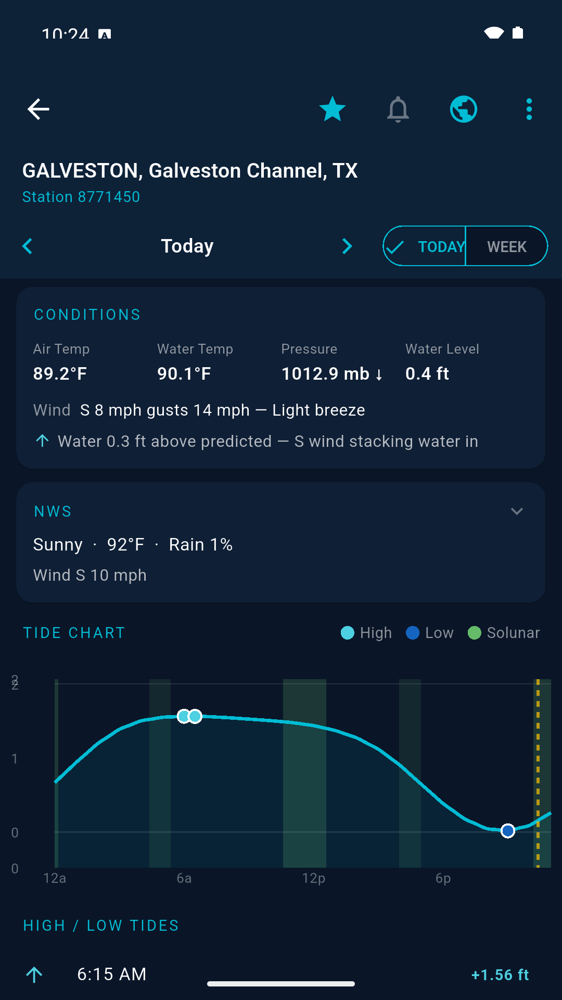 | 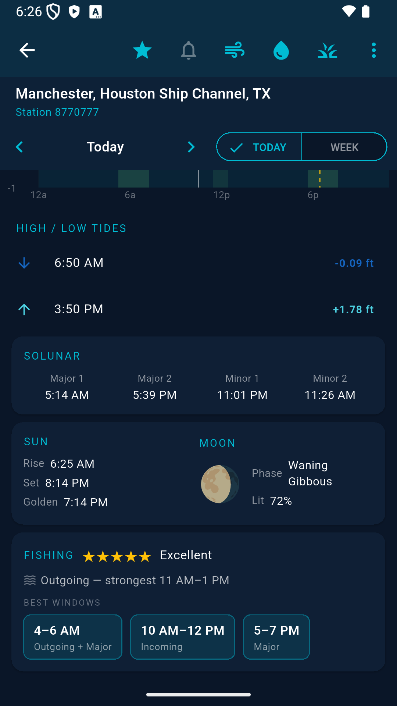 | 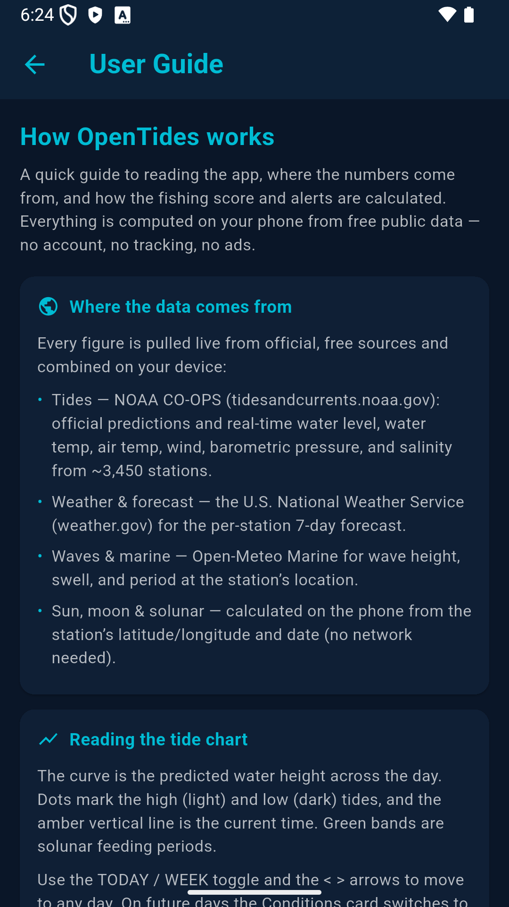 | 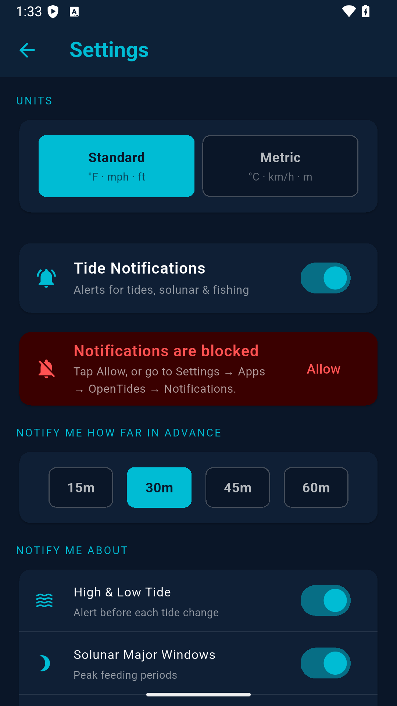 |

*The Conditions card now shows the **wind tide** — how far the live water level sits above/below the predicted tide (north winds drain the bays, south winds stack water in). The **Fishing** card folds tide movement, wind, and barometric trend into the star rating and lists today's best **bite windows**. A new **User Guide** (About → User Guide) explains the data sources and exactly how the score and alerts are calculated.*

| Home | Conditions & Waves (today) | Tides, Solunar & Moon |
|------|-------------------|----------------------|
| 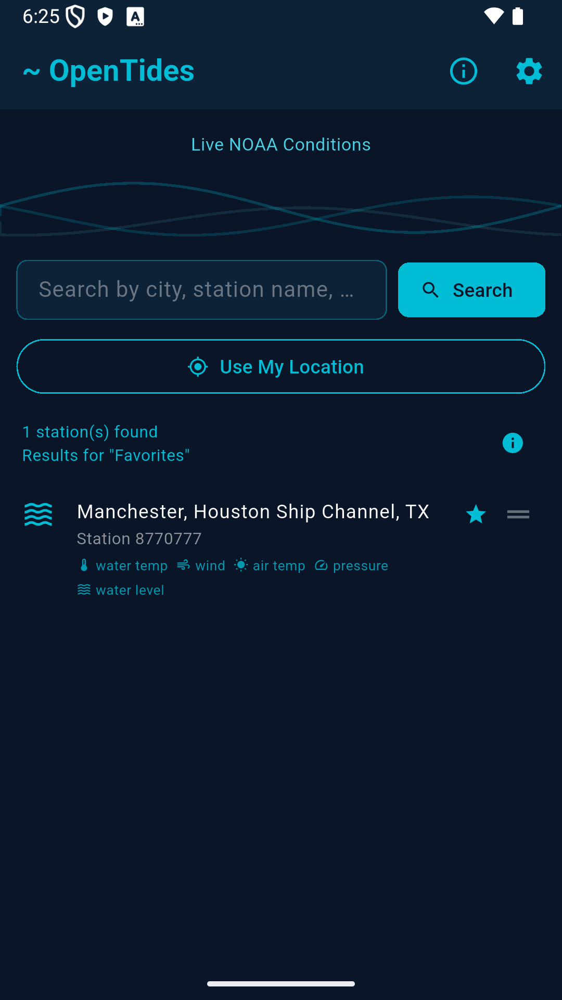 | 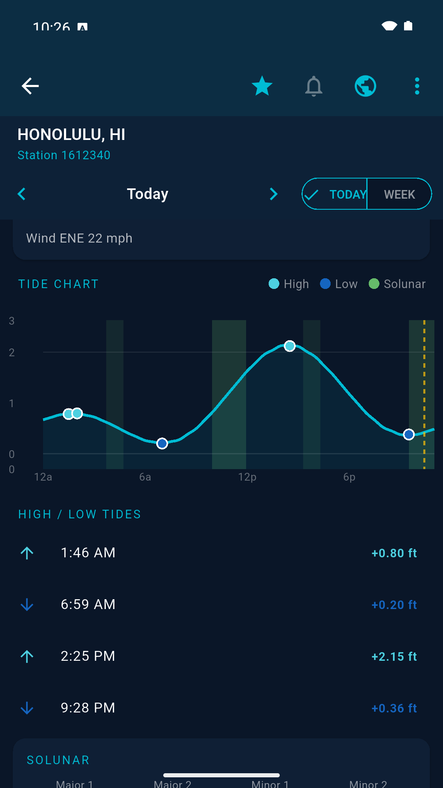 | 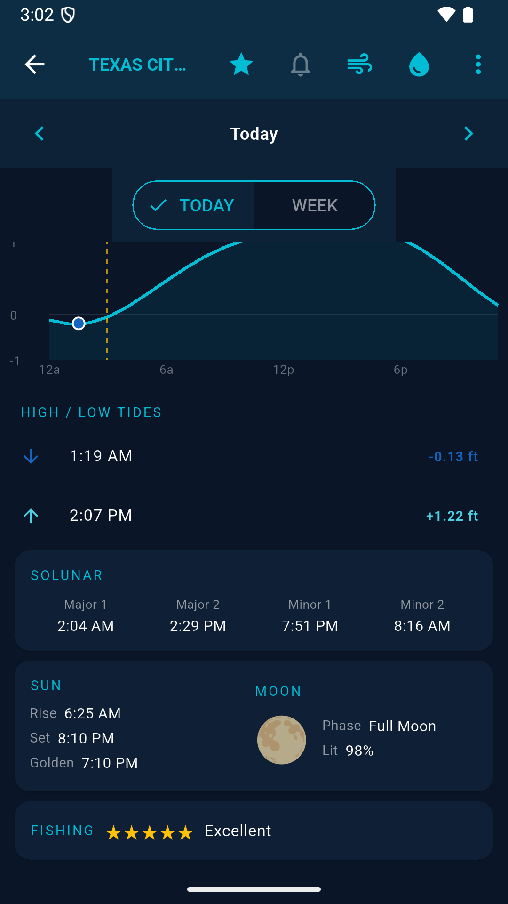 |

| Future-day forecast (arrow to any day) |
|----------------------------------------|
| 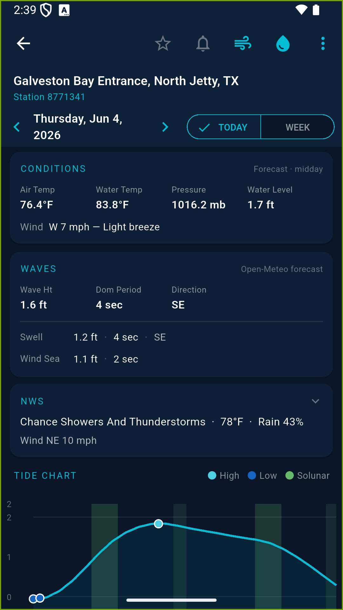 |

*Conditions and Waves follow the day/week navigation — future days show that day's Open-Meteo forecast (tagged **Forecast · midday**); today shows live NOAA observations.*

### Weather map — native, Windy-style overlays

A fully custom map (no third-party embed): a smooth GPU gradient wash, animated
particle flow, and seven switchable layers. Tap anywhere to read the value at
that point; the data follows the map as you pan and zoom.

| Wind (gradient + particles) | Layer picker | Swell |
|------|-------------|-------|
| 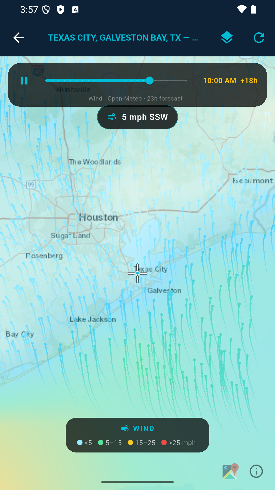 | 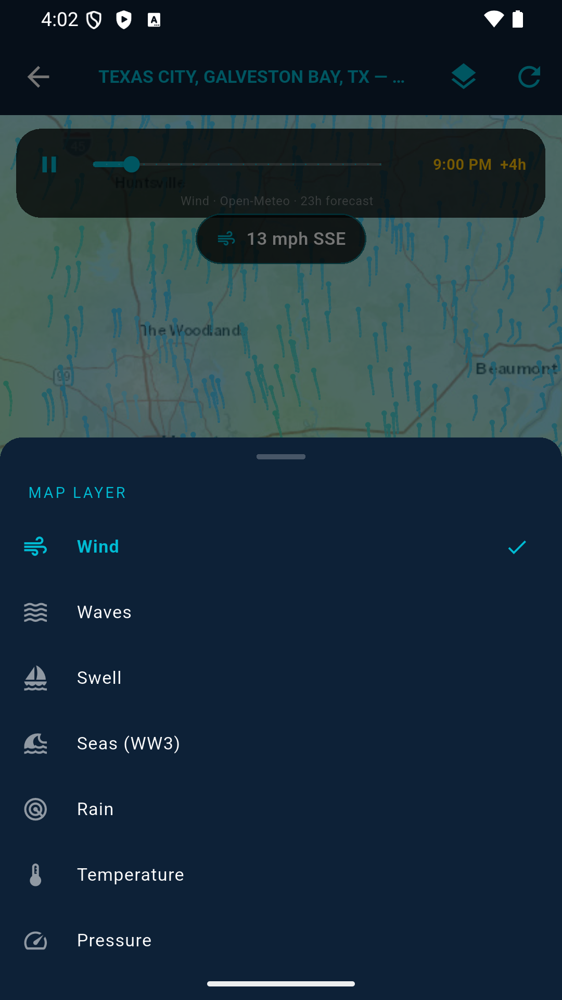 | 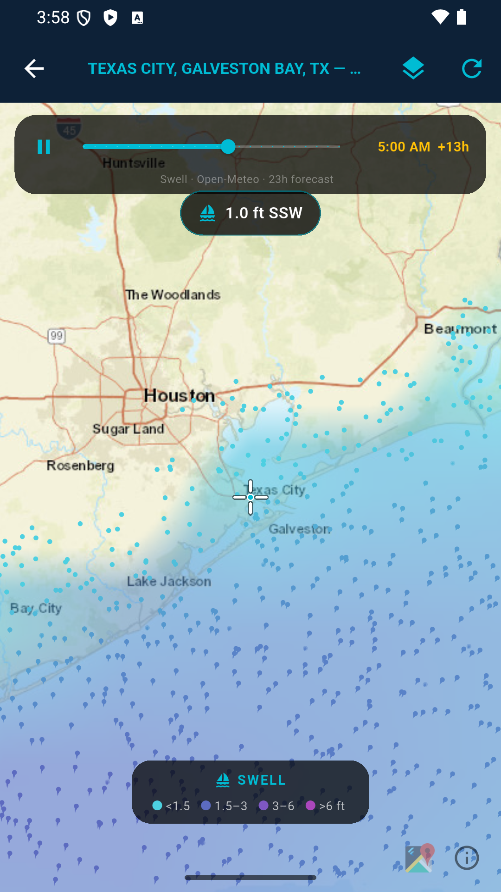 |

| NOAA radar → forecast timeline | Pressure isobars | Temperature + tap-to-read |
|-----------------|------------------|---------------------------|
| 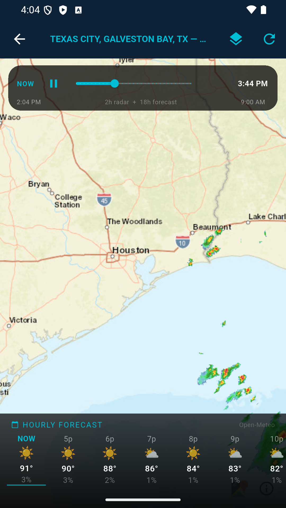 | 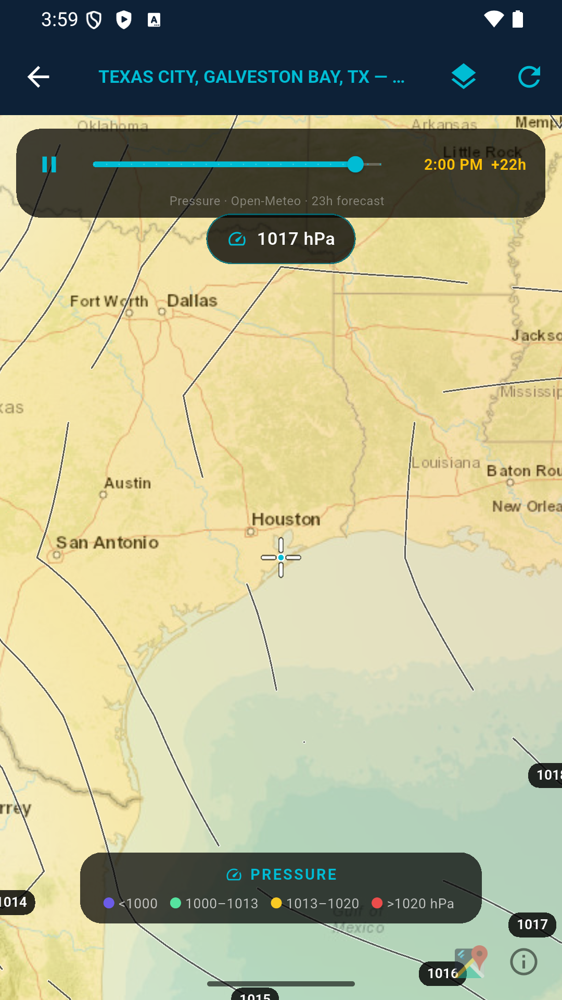 | 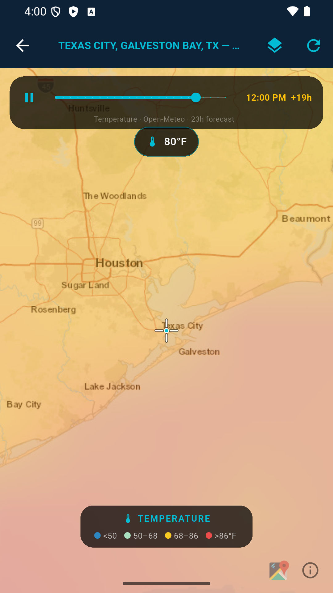 |

| Hourly forecast strip |
|-----------------------|
| 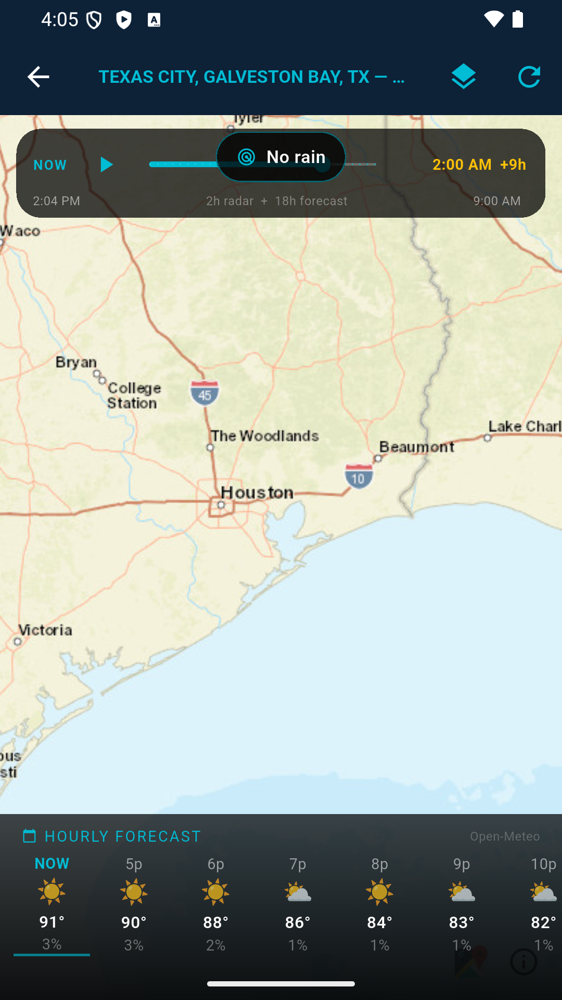 |

| Sargassum Map (NOAA SIR — daily coastal inundation risk) |
|----------------------------------------------------------|
| 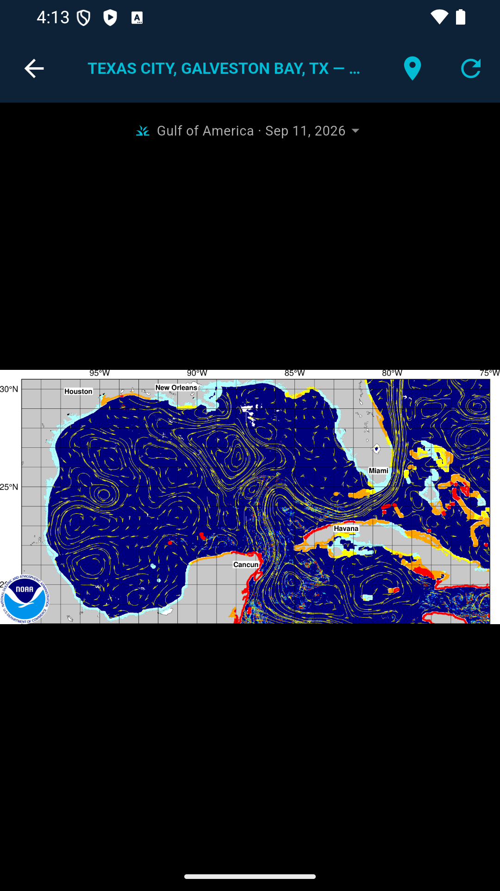 |

### Units

| Standard / Metric toggle |
|--------------------------|
| 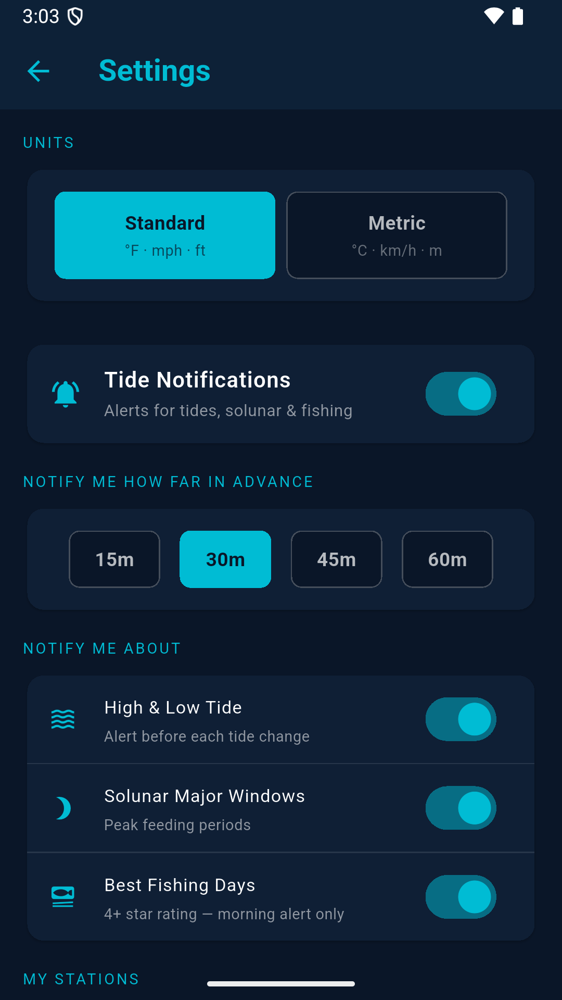 |

| Salinity Map (NOAA NGOFS2 forecast loop) |
|------------------------------------------|
| 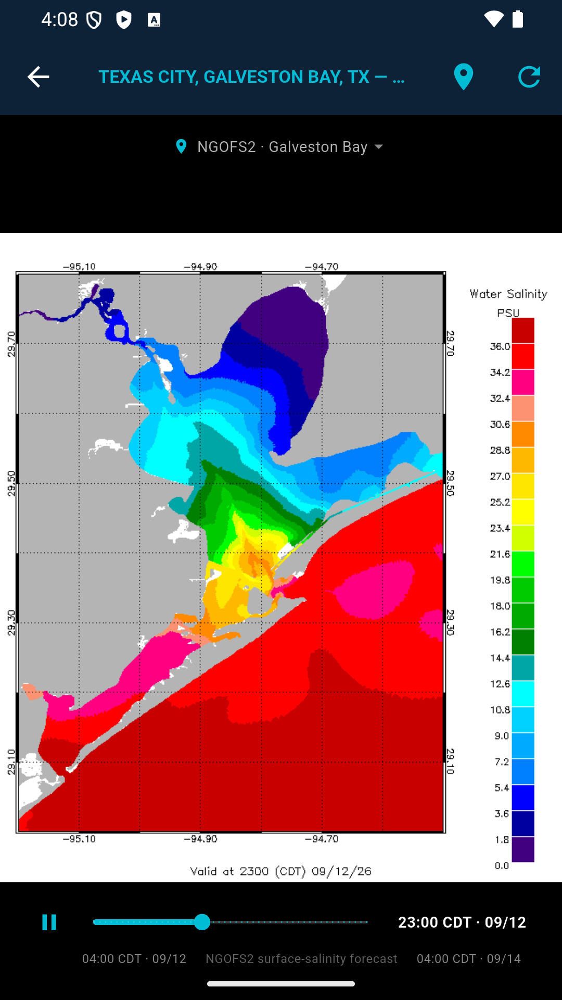 |

---

## Android Auto _(in testing — `dev` branch)_

OpenTides runs on **Android Auto** head units as part of the same app — one install, no separate download. When the phone connects to a car, OpenTides appears in the car launcher under the weather category and shows a glanceable, driver-safe view:

- **Favourites list** — your saved stations, read straight from the phone app (no re-setup, no location permission needed).
- **Tap a station → next high/low tides** — time and height for the upcoming tides, fetched live from NOAA, with a Refresh action.

Built natively with Google's Car App Library (template UI). The car service is **dormant until you connect to a car**, so there's zero impact on the phone app and only ~0.1 MB added to the download. Currently on the `dev` branch pending on-device head-unit testing; sideload `tides-3.4-dev.apk` to try it.

---

## Changelog

### v3.4.0 (build 47, dev) — **Android Auto**
- **Android Auto support** — OpenTides now appears on Android Auto car displays (same app, one install). Shows your favourite stations and the next high/low tides for any of them, fetched live from NOAA — glanceable and driver-safe. Built with Google's Car App Library (weather category); the car service stays dormant until you connect to a car, so it adds no phone-runtime cost and ~0.1 MB to the app. On `dev` pending on-device head-unit testing.

### v3.4.0 (build 46) — **Texas angler features + User Guide**
- **Wind-tide indicator** — the Conditions card now shows the live water level vs. the predicted tide ("Water 0.7 ft below predicted"). On the Texas coast this reveals wind setup: north winds drain the bays and back-lakes (below prediction), south winds stack water in (above). Today only, on stations with a live water-level sensor. Computed from data already fetched — no new API.
- **Smarter fishing score + best windows** — the 1–5 star rating now folds in **moving water** (the tide's rate of change vs. the day's strongest), a **falling-barometer** bump (fish feed ahead of fronts), and the existing solunar + wind factors. The Fishing card adds a movement line ("Incoming — strongest 2–4 PM") and today's top 2–3 **bite windows**.
- **Cold-front alert** — a new *Pressure Drops* notification fires when the barometer is falling (a front approaching, often a strong pre-front bite). Once per day per station, reusing the existing alert framework.
- **In-app User Guide** — a new *User Guide — how it works* button on the About page opens a plain-language guide: where the data comes from (NOAA CO-OPS, NWS, Open-Meteo Marine, on-device solunar/sun/moon), how to read the tide chart and wind tide, exactly how the fishing score and best windows are calculated, and how each alert type fires.

### v3.3.0 (build 44)
- **Station pin on all wind map layers** — a cyan location pin marks your station on every wind map layer (Wind, Waves, Swell, Rain, Temperature, Pressure, Clouds). Visible over both the light basemap and the dark satellite view thanks to a black + white shadow.

### v3.3.0 (build 43) — **OpenTides rebrand**
- **Renamed to OpenTides** — the app is now called *OpenTides* with the tagline *free · open · forever*, reflecting its open-source, always-free identity.
- **New launcher icon** — same navy night sky / crescent moon / cyan waves design language, updated with the OpenTides name and tagline across all Android screen densities.
- **About screen** updated to match: *"~ OpenTides · Version 3.3 · free · open · forever"*.

### v3.3.0 (build 42)
- **Extended date prefetch** — favorites are now prefetched across a **10-day window** (2 days back + today + 7 days ahead) on startup. The full week-forward and 2-day-back navigation on any favorite is instant after background fetches complete.

### v3.3.0 (build 41)
- **Faster date navigation** — on startup the app prefetches tide/weather data for each favorite station across a 5-day window (yesterday + today + 3 days ahead). Tapping the forward/back arrows on a favorite is instant after the background fetch completes. Non-today dates use a 6-hour cache TTL (tide predictions don't change intra-day); today keeps the existing 30-minute TTL for live conditions.

### v3.3.0 (build 40)
- **Wind map resilience during outages** — when Open-Meteo's weather service is unreachable, the wind map now falls back to the last successfully loaded grid and shows an amber banner: *"Open-Meteo down · last data Xm ago · tap to retry"*. The map stays useful during short outages instead of going blank.
- **Better error messages** — the wind map now distinguishes between a service outage (*"Open-Meteo is temporarily down — try again in a few minutes"*), a network timeout (*"Request timed out — check your connection"*), and no data at a location, instead of the generic "Could not load data".

### v3.3.0 (build 39)
- **Softer update-check message** — when the Play Store has no update ready (e.g. a build was just uploaded and hasn't propagated yet), the message now reads *"Nothing available right now — try again later"* instead of the alarming "Could not check for updates".

### v3.3.0 (build 38)
- **Sargassum Map screen** — dedicated 🌿 button in the detail toolbar opens a full-screen NOAA SIR (Sargassum Inundation Risk) map showing daily coastal sargassum risk for the Gulf Coast, Caribbean, and tropical Atlantic. Auto-picks the nearest region (Gulf of America, Central America, Greater Antilles, Lesser Antilles, or South America); tap the region chip to switch. Pinch-zoom up to 6× for coastline detail. Updated daily. Free, no API key (NOAA AOML / USF Optical Oceanography Lab).
- **30-minute data cache** — NOAA tide/NWS/wave data is cached in memory with a 30-minute TTL; re-opening a station within a session is instant instead of a 5–7 s spinner.
- **Favorites prefetch on startup** — when the app launches and you have favorites, their tide data is fetched in the background so tapping a favorite is instant.

### v3.3.0 (build 35)
- **Clouds layer → real animated satellite.** The Clouds layer was a near-invisible modeled cloud-cover wash that didn't reflect actual weather. It's now **live NASA GIBS / GOES-East clean-infrared satellite** — real cloud tops, with deep convection / storm anvils glowing green→orange→red. It animates on a **timeline play bar** (NOW, play/pause, scrub) over ~2 h of 10-minute frames, like the radar. Rendered over a dark basemap with a screen blend so clouds and storms pop and clear sky stays transparent.
- **Bright coastline overlay** on the satellite view — the coast, bays, rivers and state lines are drawn in cyan on top of the clouds, so you can see exactly where a cell is relative to your bay or beach. Free, no API key (NASA GIBS · NOAA GOES · Esri).

### v3.3.0 (build 34)
- **Check for Updates fix** — the in-app updater downloaded a new build but never installed it (it was missing the final `completeFlexibleUpdate()` step, so "restart the app" did nothing). It now shows an **Install** button once the download finishes, which applies the update and restarts into the new version. Sideloaded builds get a clear "update via Google Play" message instead of a dead "downloading" state.

### v3.3.0 (build 33)
- **Conditions & Waves now follow the day/week navigation** — for any day other than today, the Conditions and Waves cards show that day's forecast (Open-Meteo land + marine, sampled at midday) instead of staying stuck on today's live readings. Today still shows live NOAA observations. Cards are tagged *Forecast · midday* / *Open-Meteo forecast*.
- **Map legend fix** — the weather-map legend now sits above the system navigation/gesture bar (was clipped on Samsung devices).
- Thanks to **SGrem** for the detailed feedback that prompted both fixes. 🎣

### v3.3.0 — (NOAA radar + unified rain timeline)
- **NOAA MRMS radar** — the Rain layer's live/observed portion now renders NOAA's MRMS composite reflectivity (`conus_cref_qcd`) via WMS — the same full-resolution, ~2-minute-cadence national radar mosaic the major weather apps show. Free, no API key, US coverage. Replaces RainViewer.
- **Unified rain timeline** — one scrubbable timeline flows seamlessly from ~2 h of observed NOAA radar, through *now*, into an 18 h precipitation forecast. No mode toggle; a **NOW** button jumps back to the current frame.
- **Hourly forecast strip** — a scrollable bottom strip shows the next 18 h: weather icon, temperature, and rain probability per hour (Open-Meteo).
- **Smoother forecast overlay** — the forecast precipitation grid was densified (16×16) and is rendered at 128 px with bilinear interpolation, so it reads as smooth precipitation instead of blocky patches.
- **Fishing rating on every day** — the Fishing card now appears for future days too (a solunar-vs-tide alignment score), not just today.
- **Detail header cleanup** — full station name + ID always visible in a banner; date arrows and the TODAY/WEEK toggle share one compact row.

### v3.2.0 (build 30)
- **Hourly forecast strip** added to the Rain forecast view (weather icon · temp · rain %, 18 h ahead).
- **Fishing rating shown for all days**, not only today.

### v3.1.0 (build 28)
- **Rain forecast mode** — a LIVE/FCST toggle (since superseded by the unified timeline in 3.3) added an 18 h Open-Meteo precipitation forecast alongside the live radar.
- **Detail screen** station header redesigned (full name + ID banner, merged nav row).

### v3.0.0 (native-maps rewrite)
- **Native weather map** — replaced the Windy embed with a fully custom Flutter map (flutter_map + Open-Meteo, no third-party branding or WebView): a smooth GPU-scaled gradient wash plus an animated particle flow rendered with a `CustomPainter`
- **Seven layers** — Wind, Waves, Swell, Rain, Temperature, Pressure, Clouds, chosen from a bottom-sheet layer picker; each with its own colour ramp and legend
- **Live rain radar** — the Rain layer shows real weather radar (RainViewer) with an animated, scrubbable timeline (~2 h of frames) and a play/pause control
- **Pressure isobars** — Windy-style labelled contour lines drawn with marching squares; the view zooms out so the synoptic pattern is visible
- **Tap-to-read** — tap anywhere on any layer to read the interpolated value (speed/height + compass direction for vector layers), unit-aware
- **Data follows the map** — the overlay grid re-fetches to cover the visible area as you pan/zoom, so there's no hard overlay edge
- **Units setting** — Standard (°F · mph · ft) or Metric (°C · km/h · m) in Settings; applies across the map, detail screen, tide chart, and notifications
- **Solunar bands on the tide chart** — shaded green feeding-period bands (wider/brighter majors, narrower/fainter minors), like the dashboard
- **Reorder favorites** — drag the ≡ handle on any favorite to reorder your list (long-press still removes, tap still opens)
- **Salinity map** — the native NOAA NGOFS2 surface-salinity loop (water-drop toolbar icon) carried over from main: play/pause + scrub timeline, pinch-zoom, auto-selected Gulf region, and an out-of-coverage notice for non-Gulf stations

### v2.3.0 (build 19)
- **Reorder favorites** — drag the ≡ handle on any favorite to reorder your list; the order is saved. Long-press still removes a favorite and tap still opens it.

### v2.3.0 (build 18)
- **Week view fix** — the 7-day view now rolls forward from today instead of starting on the calendar-week Monday (which showed mostly past days, with mismatched NWS forecasts, late in the week)
- **Station name on detail** — the full station name now appears in the detail body (the app-bar title truncates when several toolbar actions are present)
- **Salinity out-of-area handling** — opening the salinity map for a station outside NGOFS2's Gulf coverage now shows a clear "covers Gulf of America bays" message with a *Browse Gulf regions* option, instead of a misleading out-of-area map

### v2.3.0 (build 17)
- **Salinity map** — animated NOAA NGOFS2 (Northern Gulf OFS) hourly surface-salinity forecast loop, opened from the water-drop icon in any station's toolbar. Play/pause + scrub timeline, pinch-to-zoom, and a region picker that auto-selects the Gulf bay nearest the station (Galveston, Matagorda, Corpus Christi, Sabine, Calcasieu, Mobile, Pascagoula, and a whole-Gulf overview)

### v2.3.0 (build 15)
- **Wind map upgrade** — switched to Windy embed2 for full color gradient overlay, animated wind particle flow, isobar pressure lines, and a forecast timeline scrubber at the bottom
- **Wind map layers** — expanded overlay menu adds Swell and Pressure; active overlay shows a checkmark
- **Wind map** — initial Windy map screen accessible from any station's detail view via the wind icon in the toolbar

### v2.2.0 (build 12–14)
- **Open-Meteo Marine wave data** — replaces NDBC buoy; wave height, dominant period, swell and wind-sea breakdown at exact station coordinates
- **Play Store in-app update prompt** — app checks for updates on launch; shows a banner when a new version is ready to install; "Check for Updates" in About screen queries Play Store directly
- Moon phase display overflow fix

### v2.1.0 (build 11)
- **Alarm permission removed** — switched to inexact alarms; no special permissions required, notifications still fire accurately

### v2.1.0 (build 10)
- **Salinity icon fix** — only the 21 NOAA stations with real salinity sensors show the badge

### v2.1.0 (build 9)
- **Station sensor icons** — sensor badge icons in search results for water temp, salinity, wind, air temp, pressure, water level
- **Current-time indicator** — amber dashed line on tide chart marks the current hour

### v2.1.0 (build 7–8)
- **Interactive tide chart** — tap or drag to see time + height readout anywhere on the curve
- **NWS fix** — forecast now works for offshore/coastal stations via coordinate fallback

### v2.0.0
- Full rewrite in Flutter (replaces Python/Kivy v1.x)
- Live 24-hour tide charts with hi/lo markers
- All ~3,450 NOAA tide stations — search by city, name, or state
- Real-time conditions: air & water temp, pressure, water level, salinity
- NWS 7-day forecast per station with expandable daily detail
- Week view: 7 days of hi/lo tides with NWS forecast
- Solunar tables: major & minor feeding periods
- Sun & moon: sunrise, sunset, golden hour, phase, illumination
- Fishing rating (1–5 stars) based on tides, solunar timing, and wind
- Favorites and GPS-based nearest stations
- Tide change and solunar notifications

---

## Features

- **Live tide charts** — smooth cosine-interpolated curves with high/low dot markers and a current-time dashed line
- **All ~3,450 NOAA stations** — search by city, station name, or state
- **Real-time conditions** — air temp, water temp, barometric pressure (with trend ↑↓), water level, salinity
- **Wave data** — wave height, dominant period, swell height/period/direction, and wind sea from Open-Meteo Marine at each station's exact coordinates
- **NWS weather** — current conditions + 7-day forecast per station
- **Week view** — 7 days of hi/lo tides with NWS temperature and short forecast; tap any day to expand
- **Solunar tables** — major/minor feeding periods calculated from moon position
- **Sun & moon** — sunrise, sunset, golden hour, moon phase and illumination percentage
- **Fishing rating** — 1–5 star rating based on tidal movement, solunar timing, and wind; shown for every day (future days use a solunar-vs-tide alignment score)
- **Interactive tide chart** — tap or drag anywhere to see exact time and height
- **Weather map** — a native, Windy-style map (no third-party embed) with a smooth gradient wash and animated particle flow. Seven layers: **Wind, Waves, Swell, Rain, Temperature, Pressure, Clouds**
  - **NOAA radar → forecast** — a unified scrubbable timeline: ~2 h of NOAA MRMS composite-reflectivity radar flows through *now* into an 18 h precipitation forecast, with a NOW button and an hourly strip (icon · temp · rain %)
  - **Pressure isobars** — labelled contour lines, synoptic-scale view
  - **Tap-to-read** — tap anywhere to read the value (and direction) at that point
  - **Follows the map** — the overlay re-fetches to cover wherever you pan or zoom
- **Units** — Standard (°F · mph · ft) or Metric (°C · km/h · m), applied everywhere
- **Salinity map** — animated NOAA NGOFS2 surface-salinity forecast loop for Gulf bays, with play/pause timeline, pinch-zoom, and an auto-selected region picker
- **In-app updates** — automatically checks for Play Store updates on launch; prompts with RESTART / LATER banner when ready
- **Favorites** — save a station by long-pressing it in the list (or the star on the detail screen); shown on the home screen, drag the ≡ handle to reorder, long-press to remove
- **Use My Location** — GPS-based nearest stations
- **Notifications** — alerts for tide changes, solunar majors, and best fishing days

---

## Tech Stack

| Layer | Technology |
|---|---|
| UI | Flutter 3.44+ / Material 3 |
| State | Riverpod (FutureProvider, StateProvider) |
| Charts | fl_chart |
| HTTP | Dio |
| Location | Geolocator |
| Storage | shared_preferences |
| Tide data | NOAA CO-OPS API |
| Weather | NWS weather.gov API |
| Wave data | Open-Meteo Marine API (CC BY 4.0) |
| Weather map | flutter_map + latlong2 · custom `CustomPainter` gradient & particles |
| Map forecast | Open-Meteo forecast & marine APIs |
| Rain radar | NOAA MRMS composite reflectivity via WMS (NCEP GeoServer, free, no key) |
| Basemap tiles | CARTO Voyager (© CARTO, © OpenStreetMap) |
| Salinity map | NOAA NGOFS2 OFS forecast plots (tidesandcurrents CDN) |
| Updates | Google Play In-App Update API |

---

## Building from Source

### Prerequisites
- Flutter SDK 3.44+
- Android SDK with API 35+
- Java 17

```bash
cd tides_flutter
flutter pub get
flutter build apk --release
```

### Debug (emulator x86_64)
```bash
flutter build apk --debug --target-platform android-x64
adb install build/app/outputs/flutter-apk/app-debug.apk
```

### Signed Android release build
Create `tides_flutter/android/key.properties` — **never commit this file**:

```properties
storeFile=../../tides.keystore
storePassword=YOUR_STORE_PASSWORD
keyAlias=tides
keyPassword=YOUR_KEY_PASSWORD
```

Then build the App Bundle for Play Store submission:
```bash
flutter build appbundle --release
# Output: tides_flutter/build/app/outputs/bundle/release/app-release.aab
```

---

## Project Structure

```
tides-mobile/
├── tides_flutter/       Flutter app (primary)
│   ├── lib/
│   │   ├── models/      Data models (TideData, Conditions, WaveData, etc.)
│   │   ├── providers/   Riverpod state providers (incl. units_provider)
│   │   ├── screens/     HomeScreen, DetailScreen, WindMapScreen, SalinityMapScreen, Settings, About
│   │   ├── services/    noaa_api.dart, location_service.dart, notification_service.dart
│   │   ├── utils/       unit_format.dart (Standard/Metric formatting)
│   │   └── widgets/     TideChart, ConditionsCard, StationTile, WaveHeader
│   └── android/         Android build config
├── screenshots/         App screenshots
└── legacy/              Original Python/Kivy v1.2 (archived)
```

The weather map lives in `screens/wind_map_screen.dart` — gradient, particles,
isobars, radar, and the layer system are all self-contained there.

---

## Data Sources

- **NOAA CO-OPS API** — tide predictions, observations, water level, salinity  
  https://api.tidesandcurrents.noaa.gov/
- **NWS / weather.gov** — 7-day forecasts and hourly conditions  
  https://api.weather.gov/
- **Open-Meteo** — forecast (wind, temperature, pressure, cloud, precipitation) and marine (wave/swell) data for the weather map; wave data on the detail screen (CC BY 4.0)  
  https://open-meteo.com/
- **NOAA / NWS MRMS** — composite-reflectivity radar (`conus_cref_qcd`) for the Rain layer's live/observed timeline, served as WMS from the NCEP GeoServer (public domain, no API key)  
  https://opengeo.ncep.noaa.gov/geoserver/conus/wms · https://mrms.ncep.noaa.gov/
- **CARTO / OpenStreetMap** — Voyager basemap tiles for the weather map  
  https://carto.com/ · https://www.openstreetmap.org/
- **NOAA NGOFS2 OFS** — hourly surface-salinity forecast map plots (Northern Gulf of America Operational Forecast System)  
  https://tidesandcurrents.noaa.gov/ofs/ofs_mapplots.html

---

## App ID

`com.mattbettinger.tides`

---

## Developer

Matt Bettinger — tides-mobile.human695@passmail.com

---

## License

MIT — free to use, modify, and distribute.
