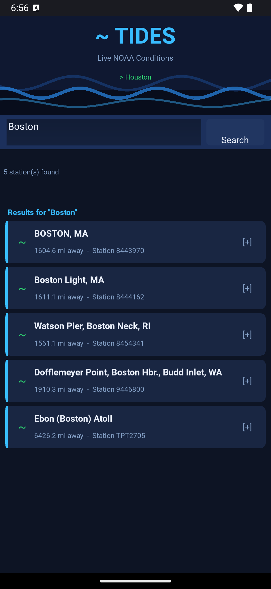
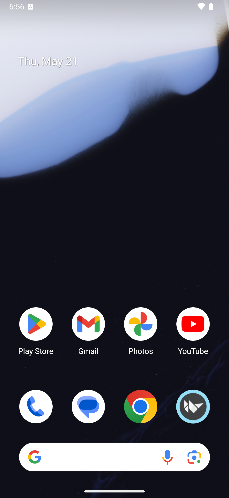
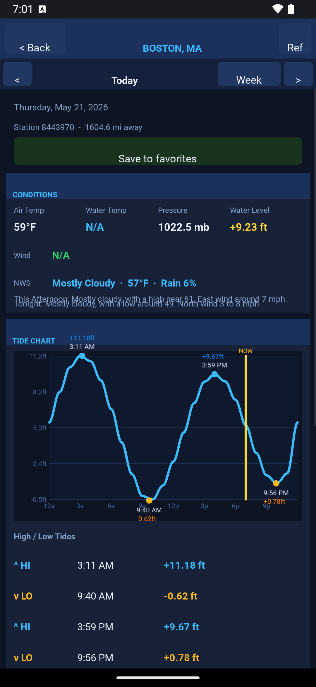
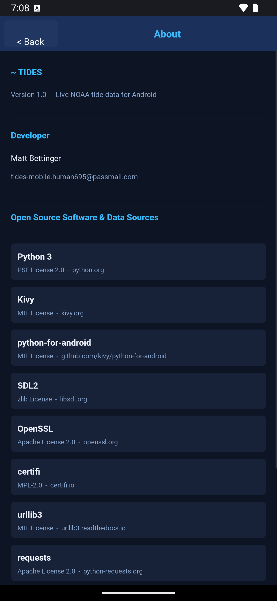

# tides-mobile

## Screenshots

| Search | Conditions & Chart | Tide Detail | About |
|---|---|---|---|
|  |  |  |  |

---

Android app version of [console-tides](../console-tides) — same live NOAA data, now with a touch UI built in [Kivy](https://kivy.org).

---

## What it shows

| Screen | Content |
|---|---|
| **Station search** | Search ~3,450 NOAA tide stations by city/name/state; saved favorites |
| **Conditions** | Air & water temp, wind speed/direction/gusts, pressure, observed water level, NWS forecast |
| **Tide chart** | 24-hour smooth wave chart with hi/lo markers and current-time indicator |
| **Sun & Moon** | Sunrise, solar noon, sunset, golden hour, moon phase + illumination |
| **Solunar periods** | Major (2-hour) and minor (1-hour) feeding windows with live NOW marker |
| **Fishing rating** | 1–5 star rating based on tide stage, wind, and solunar alignment |

---

## Prerequisites

### Desktop / development testing

```bash
pip install kivy
python3 main.py
```

Kivy runs the same code on Linux/macOS/Windows — test the full UI on your desktop before building for Android.

### Building the APK

You need **Buildozer** and its Android toolchain (Java JDK 17, Android SDK/NDK). The easiest way is inside Docker or on Ubuntu/Debian:

```bash
# 1. Install Buildozer
pip install buildozer

# 2. Install system deps (Ubuntu/Debian)
sudo apt-get install -y \
    git zip unzip openjdk-17-jdk \
    python3-pip python3-setuptools \
    libffi-dev libssl-dev

# 3. Build (first run downloads ~1 GB of Android toolchain — takes 15-30 min)
cd tides-android
buildozer android debug

# APK lands at:
#   bin/tides-1.0-arm64-v8a-debug.apk
```

### Installing on your phone

```bash
# USB debugging on, then:
buildozer android deploy run

# Or copy the APK manually and open it on the phone:
adb install bin/tides-1.0-arm64-v8a-debug.apk
```

---

## Project structure

```
tides-android/
├── main.py          Kivy app — all screens and widgets
├── tides_data.py    Pure data layer — NOAA fetching, astronomy math, favorites
├── buildozer.spec   Android build config
└── README.md
```

`tides_data.py` has no Kivy dependency and can be imported by the terminal `tides.py` too — shared data logic.

---

## Favorites

Favorites are stored at `~/.config/tides/favorites.json` — the same file used by the terminal script. Search for a station, tap it, and tap **Save to favorites** on the tide screen. Remove favorites from the star (★) row in the search list.

---

## No API key required

All data comes from free public APIs:
- **NOAA CO-OPS** — tidesandcurrents.noaa.gov
- **National Weather Service** — weather.gov
